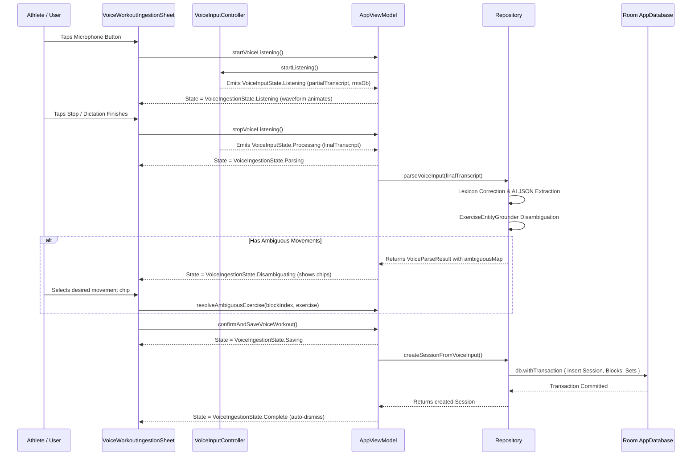
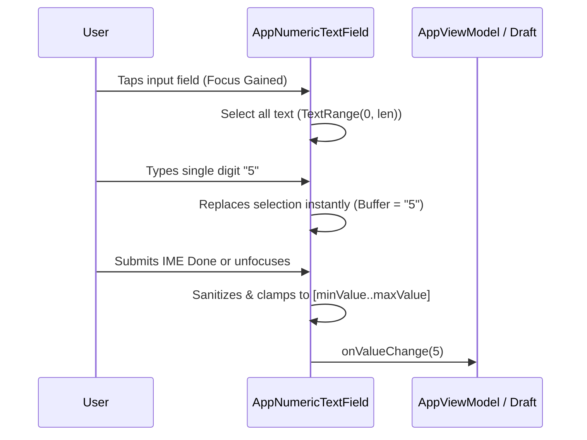

# CrossTraining App — System Architecture & Standards

## System Overview & Technology Stack

**CrossTraining** (`com.fractanomics.crosstraining`) is an offline-first Android application engineered for CrossFit athletes, strength trainees, and strength & conditioning coaches. The platform enables comprehensive tracking of strength progressions, complex barbell routines, periodized training cycles, monostructural conditioning metrics, audio/haptic interval timers, natural language voice workout dictation, dual-sandbox data isolation, and multi-tenant cloud synchronization.

```mermaid
graph TD
    subgraph Presentation ["Presentation Layer (Jetpack Compose / Material 3)"]
        UI["Compose Screens & Modals (ui.screens, ui.voice, ui.components)"]
        VM["AppViewModel (UDF State Holder & Flow Combinator)"]
        Nav["Navigation Compose & NavigationIntentHandler"]
    end

    subgraph AudioAI ["Voice & On-Device AI Subsystem"]
        VoiceCtrl["VoiceInputController (SpeechRecognizer & Noise Suppression)"]
        Lexicon["FitnessSpeechLexicon (Phonetic & STT Normalization)"]
        AiCore["AiCoreManager (Gemini Nano / Heuristic Fallback)"]
        Grounder["ExerciseEntityGrounder (Fuzzy Matching & Movement Disambiguation)"]
    end

    subgraph DataPersistence ["Data Layer & Local Persistence"]
        DMM["DataModeManager (Dual-Sandbox Routing: Live vs Demo)"]
        Repo["Repository (Single Source of Truth & Atomic Persistence)"]
        RoomDB[("Room AppDatabase (SQLite, Migrations v1-v5)")]
    end

    subgraph CloudIdentity ["Cloud Sync & Identity Subsystem"]
        CredMgr["Credential Manager & Google ID (androidx.credentials)"]
        CloudSync["UserCloudSyncManager (Token-Bound Sync & Overwrite Guards)"]
        CommunitySync["FirebaseSyncManager (Share Codes & Community WODs)"]
        Firestore[("Cloud Firestore (Multi-Tenant Environments)")]
        FirebaseAuth[("Firebase Auth (UID Token Verification)")]
    end

    subgraph PeripheralsServices ["Foreground Services & Hardware Subsystems"]
        TimerSub["TimerEngine & TimerEngineProvider"]
        TimerSvc["TimerService (MediaStyle Notification & Audio/Haptics)"]
    end

    UI -->|User Intents & Input Events| VM
    VM -->|Collects StateFlow via collectAsStateWithLifecycle| UI
    VM -->|Dispatches Business Actions| Repo
    VM -->|Toggles Active Sandbox Mode| DMM
    DMM -->|Swaps Active Database Context| Repo
    Repo -->|Atomic SQL Transactions & Queries| RoomDB
    
    UI -->|Triggers Voice Ingestion Sheet| VoiceCtrl
    VoiceCtrl -->|Audio RMS dB & Partial Transcripts| VM
    VoiceCtrl -->|Final Transcript| Repo
    Repo -->|1. Phonetic Correction| Lexicon
    Repo -->|2. Structured Extraction| AiCore
    Repo -->|3. Movement Disambiguation| Grounder
    Grounder -->|Resolves Catalog IDs| RoomDB
    Repo -->|4. Atomic Commit (Session, Blocks, Sets)| RoomDB

    VM -->|Triggers Background Sync| CloudSync
    CredMgr -->|Authenticates Credentials| FirebaseAuth
    CloudSync -->|Token Verification & Cold-Start Await| FirebaseAuth
    CloudSync -->|Fault-Isolated Concurrent Upload supervisorScope| Firestore
    CommunitySync <-->|Public Routine Exchange| Firestore

    UI <-->|Observes & Controls Timer| TimerSub
    TimerSub <-->|Foreground Service & Media Notifications| TimerSvc
    Nav -.->|Routes Notification Deep Links| UI
```

### Technology Stack & Framework Specifications

| Tier / Subsystem | Technology | Specification / Version | Architectural Role |
|---|---|---|---|
| **Language & Runtime** | Kotlin | `2.0.21` / JVM 17 (`compileOptions`, `kotlinOptions`) | Strongly-typed functional & object-oriented application core |
| **Android SDK Target** | Android SDK | `minSdk 26`, `targetSdk 35`, `compileSdk 35` | Modern Android 15 platform compliance with Android 8.0+ backwards compatibility |
| **UI Toolkit** | Jetpack Compose | Compose BOM `2024.10.01`, Material 3 | Declarative, reactive, component-driven user interface |
| **Navigation** | Navigation Compose | `2.8.4` (`androidx.navigation.compose`) | Single-Activity declarative navigation host and deep-linking |
| **Persistence** | AndroidX Room | `2.6.1` with KSP `2.0.21-1.0.28` | Local relational SQLite database with typed DAOs and schema migrations |
| **Asynchronous & Concurrency** | Kotlin Coroutines & Flow | `1.9.0` (`StateFlow`, `SharedFlow`, `supervisorScope`) | Structured concurrency, reactive data streaming, non-blocking I/O |
| **Lifecycle Integration** | AndroidX Lifecycle | `2.8.7` (`lifecycle-runtime-compose`, `viewmodel-compose`) | Lifecycle-aware UI state collection (`collectAsStateWithLifecycle`) |
| **Identity & Authentication** | Credential Manager & Google ID | `androidx.credentials:1.3.0`, `googleid:1.1.1`, Play Services Auth `21.3.0` | Modern biometric, passkey, and Google ID token authentication flows |
| **Cloud Synchronization** | Firebase SDKs | Firebase BoM `33.9.0` (Firestore, Auth, Analytics) | Multi-tenant cloud synchronization, user authentication, and workout sharing |
| **On-Device AI Inference** | Android AICore / Gemini Nano | `GeminiNanoClient` contract with heuristic parser fallback | On-device structured natural language workout block and set extraction |
| **Speech Recognition** | Android SpeechRecognizer | `android.speech.SpeechRecognizer` with noise suppression flags | On-device voice dictation, real-time partial transcripts, and RMS dB streaming |
| **Media & Peripherals** | AndroidX Media & Audio | `androidx.media:1.7.0`, `ToneGenerator`, `VibratorManager` | Foreground MediaStyle notifications, audio interval cues, and haptics |
| **Build & Tooling** | Gradle Kotlin DSL | AGP `8.7.2`, Gradle Wrapper | Automated reproducible build pipelines, signing, and asset packaging |

### Multi-Environment Packaging & Build Variants

The build system defines three distinct build types:
- **`debug`**: Local development build configured with `APP_ENV="snapshot"` and signed with the standard debug keystore.
- **`snapshot`**: Pre-release CI verification build inheriting from `debug` configuration with matching fallbacks, compiled for automated E2E and device testing.
- **`release`**: Production-optimized build configured with `APP_ENV="production"`, integrating ProGuard/R8 optimizations (`proguard-rules.pro`), and signed using secure environment keystore credentials (`RELEASE_STORE_FILE`, `RELEASE_KEY_ALIAS`) with graceful debug keystore fallback.

---

## Layer Boundaries & Clean Architecture (Domain, Data, Presentation/UI separation of concerns)

The codebase strictly adheres to **Clean Architecture** principles and **Unidirectional Data Flow (UDF)**. Dependencies strictly point inward toward domain models and business logic.

```mermaid
graph RL
    subgraph Presentation ["Presentation Layer (ui)"]
        UI_Screens["Compose Screens (ui.screens)"]
        UI_Voice["Voice Ingestion UI (ui.voice)"]
        UI_Components["Design System Primitives (ui.components)"]
        UI_VM["AppViewModel (UDF State Holder)"]
        UI_Nav["Navigation & Intent Handling (ui.navigation)"]
        UI_Timer["Timer Engine & Service (ui.timer)"]
    end

    subgraph Data ["Data Layer (data)"]
        D_Repo["Repository (Single Source of Truth)"]
        D_Mode["DataModeManager (Sandbox Routing: Live vs Demo)"]
        D_AI["On-Device AI Engine (data.ai: AiCoreManager, Grounder)"]
        D_Voice["Speech Ingestion (data.voice: VoiceInputController)"]
        D_DAO["Room DAOs (data.dao)"]
        D_DB["AppDatabase (SQLite & Migrations v1-v5)"]
        D_Cloud["UserCloudSyncManager & FirebaseSyncManager (data.firebase)"]
        D_Backup["Backup & CSV Migration Engine (data.Backup)"]
    end

    subgraph Domain ["Domain & Utility Layer (util, data.model & data.ai)"]
        DOM_Models["Entities & Relations (Cycle, Session, Routine, RepMax, etc.)"]
        DOM_Enums["Domain Enums (BlockKind, MetricType, UserRole, TimerMode, etc.)"]
        DOM_Voice["Voice State Machine (VoiceIngestionState, ParsedBlock, ParsedBlockSet)"]
        DOM_Lexicon["Domain Lexicon (FitnessSpeechLexicon)"]
        DOM_Utils["Pure Algorithms (WorkoutParser, RepScheme)"]
    end

    Presentation --> Data
    Presentation --> Domain
    Data --> Domain
```



### 1. Domain & Utility Layer (`com.fractanomics.crosstraining.util`, `data.model` & pure modules in `data.ai`)
- **Responsibilities:**
  - Contains core business entities (`Cycle`, `Session`, `Routine`, `Exercise`, `RepMax`, `BlockSet`, `RoutineBlock`, `SessionBlock`, `CycleGoal`), domain value objects, and enums (`BlockKind`, `MetricType`, `ExerciseCategory`, `UserRole`, `TimerMode`, `TimerPhase`).
  - Encapsulates domain contracts for AI parsing (`ParsedBlock`, `ParsedBlockSet`, `WorkoutParseResult`, `GroundingMatch`).
  - Houses the formal 7-stage voice ingestion lifecycle state machine (`VoiceIngestionState`).
  - Encapsulates pure domain algorithms:
    - `WorkoutParser`: Regex-driven free-text workout syntax parsing, rep-scheme extraction, and movement extraction.
    - `RepScheme`: Wave-loading validation, rep-count decomposition, and string formatting.
    - `FitnessSpeechLexicon`: Pure Kotlin phonetic normalization engine mapping fitness acronyms, Olympic lifting terms, and common speech-to-text artifacts without platform dependencies.
- **Architectural Invariants:**
  - **Zero Platform Dependencies:** Must not import Android framework classes (`android.*`, `Context`, `View`, `Bundle`, Compose UI tokens).
  - **Deterministic & Pure:** All functions must be deterministic, free of side-effects, and 100% unit-testable without Android mocks, instrumentation, or Robolectric runners.

### 2. Data Layer (`com.fractanomics.crosstraining.data`)
- **Responsibilities:**
  - **Room Database & DAOs (`data.dao`):** Provides strongly-typed SQL mapping, foreign key constraints, cascading deletes, indexes, and reactive queries via Kotlin `Flow`.
  - **Single Source of Truth (`Repository`):** Coordinates multi-entity transactional persistence using `db.withTransaction { ... }`. Encapsulates write-time business logic such as auto-creating exercises (`getOrCreateExercise`), synchronizing routine blocks, discovering new rep-maxes, startup default cycle provisioning, and deduplicating routines.
  - **Dual-Sandbox Routing (`DataModeManager`):** Manages session-scoped in-memory switching between the live database (`crosstraining.db`) and the disposable sample database (`crosstraining-demo.db`), guaranteeing that demo sessions cannot corrupt athlete history. Provides `realRepository` for strictly isolated background sync operations.
  - **On-Device AI & Speech Ingestion (`data.ai`, `data.voice`):**
    - `VoiceInputController`: Wraps `SpeechRecognizer` with acoustic noise suppression intent flags, manages audio focus, streams real-time RMS dB levels and partial transcripts, and handles standardized error translation (`VoiceInputError`).
    - `AiCoreManager`: Decoupled via `GeminiNanoClient` interface. Orchestrates prompt construction commanding strict JSON schemas, parses resilient JSON, and seamlessly falls back to heuristic rule-based parsing when on-device AI is unavailable.
    - `ExerciseEntityGrounder`: Matches recognized movement text against Room `ExerciseDao` movements using exact alias maps, token overlap, and Levenshtein distance metrics (confidence threshold 0.0–1.0) to prompt disambiguation for ambiguous queries.
  - **Cloud Synchronization & Identity (`data.firebase`):**
    - `UserCloudSyncManager`: Manages token-bound identity verification, cold-start auth resolution (`awaitAuthState`), fault-isolated concurrent uploads using `supervisorScope`, per-document empty overwrite protection (`uploadCollectionWithGuard`), and dual-read cloud migrations.
    - `FirebaseSyncManager`: Global community workout publishing and retrieval via alphanumeric 6-character share codes.
    - `CloudSyncErrorMapper`: Translates Firestore network timeouts, unauthenticated states, and permission denials into user-friendly UI feedback.
  - **Backup & Migration Engine (`BackupCsv`, `AppDatabase.MIGRATION_*`):** Manages relational CSV serialization/deserialization and SQLite schema migrations (v1 through v5).
- **Architectural Invariants:**
  - DAOs must remain package-private or accessible exclusively through `Repository`.
  - All database writes, file I/O, network operations, and AI inference must execute on background coroutine dispatchers (`Dispatchers.IO`).
  - Empty local datasets must never overwrite populated remote cloud collections without explicit guard verification.

### 3. Presentation / UI Layer (`com.fractanomics.crosstraining.ui`)
- **Responsibilities:**
  - **State Orchestration (`AppViewModel`):** Central state holder for the UI. Binds reactive streams from `DataModeManager.repositoryFlow`, exposes lifecycle-safe `StateFlow<T>`, and receives user intents to trigger coroutine executions on `viewModelScope`. Exposes `voiceIngestionState` and `voiceWorkoutUiState`.
  - **Single-Activity Host & Navigation (`MainActivity`, `ui.navigation`):** Single-Activity architecture with edge-to-edge system bar configuration. Defines top-level navigation routes (`BottomDestination`, `DrawerItem`), dynamic bottom bars based on user role (`ATHLETE` vs `COACH`), and routes external notifications via `NavigationIntentHandler`.
  - **Stateful Screens & Stateless Content (`ui.screens`):** Implements strict separation between stateful container composables (which inject the ViewModel) and stateless presentation composables (which receive pure data classes and emit lambdas).
  - **Voice Ingestion UI (`ui.voice`):** `VoiceWorkoutIngestionSheet` provides real-time audio visualization with an animated multi-bar RMS waveform, live speech transcript display, interactive movement disambiguation chips, and spreadsheet-style inline set editing.
  - **Design System & Components (`ui.components`, `ui.theme`):** Encapsulates Material 3 theme tokens, typography, dynamic palettes, and robust UI primitives such as `AppNumericTextField`, `LineChart`, `ResetPasswordDialog`, and `QuickAddWorkoutDialog`.
  - **Foreground Timer Subsystem (`ui.timer`):** Hoists `TimerEngine` to application scope, running tick loops independent of activity lifecycle, and binds to `TimerService` for MediaStyle notifications, audio interval cues (`ToneGenerator`), and haptic vibrations.
- **Architectural Invariants:**
  - UI components must never instantiate or interact with Room DAOs, Firestore, or speech recognizers directly.
  - State collection in Composables must always utilize `collectAsStateWithLifecycle()` to prevent background resource leaks.
  - Transient UI state (typing buffers, dialog visibility) must remain localized to Composables via `remember { mutableStateOf(...) }`.

---

## Directory & Package Structure Guidelines

The directory structure enforces strict modular separation by technical concern, domain responsibility, and clean architectural boundaries:

```
crosstrainingapp/
├── app/
│   ├── build.gradle.kts                          # App build configuration, dependencies, and signing configs
│   ├── proguard-rules.pro                        # Proguard / R8 optimization rules
│   └── src/
│       ├── main/
│       │   ├── AndroidManifest.xml               # App manifest, permissions (audio, notifications, foreground), services
│       │   └── java/com/fractanomics/crosstraining/
│       │       ├── CrossTrainingApp.kt           # Application class & Composition Root (DataModeManager, TimerEngine)
│       │       ├── MainActivity.kt               # Single Activity host with Edge-to-Edge & NavigationIntentHandler
│       │       ├── data/
│       │       │   ├── AppDatabase.kt            # Room database definition, type converters, & migrations (v1-v5)
│       │       │   ├── Backup.kt                 # Relational CSV export and import serialization engine
│       │       │   ├── Converters.kt             # Room type converters (LocalDate, enums, primitives)
│       │       │   ├── DataModeManager.kt        # Dual-database routing (Live vs Demo) & session-scoped isolation
│       │       │   ├── DemoData.kt               # Isolated comprehensive demo dataset generator
│       │       │   ├── Repository.kt             # Single Source of Truth repository with atomic transaction writes
│       │       │   ├── SeedData.kt               # Starter database seeding (exercises, routines, sample cycles)
│       │       │   ├── VoiceIngestionState.kt    # 7-stage voice ingestion lifecycle state machine
│       │       │   ├── ai/                       # On-device AI inference, phonetic normalization, & grounding
│       │       │   │   ├── AiCoreManager.kt      # Gemini Nano / AICore orchestrator & resilient JSON parser
│       │       │   │   ├── ExerciseEntityGrounder.kt # Movement name grounding & Levenshtein disambiguation
│       │       │   │   └── FitnessSpeechLexicon.kt   # Pure Kotlin phonetic dictionary & fitness STT normalizer
│       │       │   ├── dao/                      # Room Data Access Objects
│       │       │   │   ├── BlockDao.kt           # Session blocks and block sets DAO
│       │       │   │   ├── CycleDao.kt           # Training cycles DAO
│       │       │   │   ├── CycleGoalDao.kt       # Periodization cycle goals DAO
│       │       │   │   ├── ExerciseDao.kt        # Movement and exercise catalog DAO
│       │       │   │   ├── RepMaxDao.kt          # Personal records & rep-max history DAO
│       │       │   │   ├── RoutineDao.kt         # Routines and routine blocks DAO
│       │       │   └── SessionDao.kt         # Logged workouts & session history DAO
│       │       ├── ui/
│       │       │   ├── AppViewModel.kt           # Unified UI ViewModel exposing StateFlows and dispatching actions
│       │       │   ├── Format.kt                 # UI display formatting helpers (dates, weights, times, scores)
│       │       │   ├── ProgressAnalytics.kt      # Rep-max calculation, volume progression, and PR charting models
│       │       │   ├── SessionDraft.kt           # Ephemeral UI editing models for workout logging & editing
│       │       │   ├── components/               # Reusable Jetpack Compose UI components & design system
│       │       │   │   ├── CommonUi.kt           # Shared UI buttons, headers, cards, AppNumericTextField, modal sheets
│       │       │   │   ├── DateField.kt          # Date picker field with Material 3 integration
│       │       │   │   ├── Dropdown.kt           # Form dropdown selector
│       │       │   │   ├── LineChart.kt          # Custom Canvas-rendered strength progression line chart
│       │       │   │   ├── QuickAddWorkoutDialog.kt # Modal dialog for quick workout insertion
│       │       │   │   └── ResetPasswordDialog.kt   # Password reset modal dialog with regex validation
│       │       │   ├── navigation/               # Navigation topology & routing
│       │       │   │   ├── AppNavigation.kt      # NavHost, BottomNavigationBar, and ModalNavigationDrawer
│       │       │   │   └── NavigationIntentHandler.kt # Deep-link and notification intent routing handler
│       │       │   ├── screens/                  # Top-level screen composables
│       │       │   │   ├── CyclesScreen.kt       # Training cycle management & periodization planning
│       │       │   │   ├── HistoryScreen.kt      # Historical training session log & search
│       │       │   │   ├── LibraryScreen.kt      # Movement catalog & routine builder
│       │       │   │   ├── LoginWelcomeScreen.kt # Authentication, Google Sign-In, Credential Manager, & Guest mode
│       │       │   │   ├── LogSessionScreen.kt   # Daily workout logging screen
│       │       │   │   ├── ProfileScreen.kt      # User account, theme toggle, CSV backup, & sync recovery cards
│       │       │   │   ├── ProgressScreen.kt     # Personal record analytics & progression charts
│       │       │   │   ├── SessionEditor.kt      # Comprehensive session editor with set spreadsheet
│       │       │   │   └── TimerScreen.kt        # Workout interval timer configuration & active display
│       │       │   ├── theme/                    # Material Design 3 theme tokens
│       │       │   │   ├── Color.kt              # App color palettes
│       │       │   │   ├── Theme.kt              # CrossTrainingTheme wrapper with light/dark/system support
│       │       │   │   └── Type.kt               # Typography specifications
│       │       │   ├── timer/                    # Foreground Timer Subsystem
│       │       │   │   ├── NotificationPermissionHelper.kt # Runtime notification permission check & launch helper
│       │       │   │   ├── TimerEngine.kt        # State machine, countdown loop, audio tones, & vibrations
│       │       │   │   ├── TimerEngineProvider.kt# Application-scoped singleton provider for TimerEngine
│       │       │   │   ├── TimerNotificationActionDispatcher.kt # Dispatches notification intent actions to TimerEngine
│       │       │   │   ├── TimerNotificationFormatter.kt # Dynamic title & content string formatter for notifications
│       │       │   │   ├── TimerNotificationSpec.kt # Notification action and metadata builder
│       │       │   │   ├── TimerService.kt       # Foreground service hosting ongoing MediaStyle notification
│       │       │   │   ├── TimerTeardownController.kt # Graceful service termination and resource release
│       │       │   │   └── WorkoutTimer.kt       # Timer data contracts (TimerMode, TimerPhase, WorkoutTimerConfig, TimerSnapshot)
│       │       │   └── voice/                    # Voice Ingestion UI
│       │       │       └── VoiceWorkoutIngestionSheet.kt # Modal bottom sheet with waveform visualizer & disambiguation
│       │       └── util/                         # Pure domain utilities
│       │           ├── RepScheme.kt              # Rep scheme pattern parsing & wave validation
│       │           └── WorkoutParser.kt          # Free-text WOD and complex routine parsing algorithms
│       └── test/java/com/fractanomics/crosstraining/ # Comprehensive Unit & Integration Test Suites (34 test classes)
│           ├── data/
│           │   ├── DataModeManagerTest.kt
│           │   ├── RoutineModelTest.kt
│           │   ├── StartupCycleProvisioningTest.kt
│           │   └── VoiceRepositoryIntegrationTest.kt
│           ├── data/ai/
│           │   ├── AiCoreManagerTest.kt
│           │   ├── ExerciseEntityGrounderTest.kt
│           │   └── FitnessSpeechLexiconTest.kt
│           ├── data/firebase/
│           │   ├── CloudSyncErrorMapperTest.kt
│           │   ├── CrossAuthSignInTest.kt
│           │   ├── TokenBoundIdentitySyncTest.kt
│           │   └── UserCloudSyncManagerOverwriteGuardTest.kt
│           ├── data/voice/
│           │   └── VoiceInputControllerTest.kt
│           ├── ui/
│           │   ├── AppViewModelCloudSyncStructuralRoutingTest.kt
│           │   ├── AppViewModelCycleSyncIsolationTest.kt
│           │   ├── AppViewModelDataModeSwitchingTest.kt
│           │   ├── AppViewModelPasswordResetTest.kt
│           │   ├── AppViewModelVoiceIngestionTest.kt
│           │   └── PasswordResetDispatchTest.kt
│           ├── ui/components/
│           │   ├── AppNumericTextFieldTest.kt
│           │   ├── QuickAddWorkoutDialogNumericMigrationTest.kt
│           │   └── ResetPasswordDialogTest.kt
│           ├── ui/screens/
│           │   ├── ProfileScreenRecoveryUnitTest.kt
│           │   ├── SessionEditorNumericMigrationTest.kt
│           │   └── TimerScreenNumericMigrationTest.kt
│           ├── ui/theme/
│           │   └── ThemeModeTest.kt
│           ├── ui/timer/
│           │   ├── NotificationPermissionTest.kt
│           │   ├── NotificationTapNavigationTest.kt
│           │   ├── SharedTimerStateTest.kt
│           │   ├── TimerEngineTest.kt
│           │   ├── TimerNotificationActionTest.kt
│           │   ├── TimerServiceTest.kt
│           │   └── TimerTeardownTest.kt
│           ├── ui/voice/
│           │   └── VoiceWorkoutIngestionSheetTest.kt
│           └── util/
│               └── WorkoutParserTest.kt
├── docs/                                         # Technical documentation & testing runbooks
│   └── local-testing.md                          # Comprehensive local testing guide & CI status check registry
├── e2e/                                          # Automated Maestro E2E test flows
│   ├── flow-mapping.json                         # Mapping of E2E test flows to functional domains
│   └── flows/                                    # Maestro YAML scenario scripts (01-06)
└── scripts/                                      # Automation scripts & CI test harnesses
    ├── crosstrainingapp.ps1                      # Unified CLI entrypoint (emulator, test, build, release)
    ├── lib/                                      # Reusable PowerShell modules (AdbEmulatorHelper, GitHubArtifactHelper, PrComment)
    └── tests/                                    # Pester test suites verifying CI pipelines and scripts
```

---

## Design Patterns, State Management & Dependency Injection

### 1. Unidirectional Data Flow (UDF) & Reactive StateFlow Architecture
The presentation layer strictly follows the UDF pattern:
- **UI State**: ViewModels expose immutable `StateFlow<T>` objects created via `stateIn(viewModelScope, SharingStarted.WhileSubscribed(5_000), initial)`. The 5-second `WhileSubscribed` timeout ensures that upstream database queries pause when the app is backgrounded, while surviving brief configuration changes (e.g. screen rotations).
- **User Intent**: Composables capture user interactions and dispatch discrete events (e.g. `viewModel.saveSession(draft)`) to the ViewModel.
- **State Collection**: Composables collect state using `collectAsStateWithLifecycle()`, guaranteeing automatic subscription binding and unbinding aligned with the Android lifecycle.

```kotlin
// ViewModel state declaration pattern
val sessions: StateFlow<List<SessionWithBlocks>> =
    data.repositoryFlow
        .flatMapLatest { it.allSessions }
        .stateIn(
            scope = viewModelScope,
            started = SharingStarted.WhileSubscribed(5_000),
            initialValue = emptyList()
        )
```

### 2. Session-Scoped Dual-Sandbox Routing Pattern (`DataModeManager`)
To provide a seamless, non-destructive trial experience ("Continue as Guest" / "Explore Demo"):
- `DataModeManager` maintains an in-memory, session-scoped data mode model unconditionally defaulting to Real Data (`demoMode = false`) on every app launch.
- Manages two distinct `Repository` instances backed by separate SQLite database files:
  1. `crosstraining.db` (Athletes' permanent real training history)
  2. `crosstraining-demo.db` (Generated sample training history)
- All ViewModel data streams subscribe to `data.repositoryFlow`, allowing live, instantaneous UI switching between real and demo databases with zero memory leaks and zero risk of cross-contamination.
- Exposes `realRepository` to isolate all background cloud sync operations (`saveCycle`, `saveCycleWithGoals`, `deleteCycleGoal`, `triggerCloudSync`), guaranteeing that demo fixtures never reach Cloud Firestore.

### 3. Multi-Tiered On-Device AI Ingestion Pattern
Voice workout dictation utilizes a 4-tier decoupled pipeline:
1. **Phonetic Normalization (`FitnessSpeechLexicon`)**: Sanitizes raw speech-to-text transcripts using an offline phonetic dictionary and regex normalizers, correcting common CrossFit acronyms, units, and acoustic misrecognitions (e.g., "front squad" -> "Front Squat", "100k" -> "100 kg", "e2 mom" -> "E2MOM").
2. **AI Inference Contract (`GeminiNanoClient`)**: Decouples the application from physical AI hardware via a mockable interface.
3. **Structured Extraction (`AiCoreManager`)**: Commands strict JSON schemas for workout blocks, rep-schemes, and weights. Features a resilient JSON parser capable of recovering from malformed syntax (markdown code fences, trailing commas, unquoted keys). Falls back to heuristic rules (`fallbackParseVoiceText`) when on-device AI is unavailable.
4. **Entity Grounding & Disambiguation (`ExerciseEntityGrounder`)**: Matches recognized movement names against the catalog in Room SQLite using exact alias maps and Levenshtein distance metrics (threshold `<= 2`), calculating confidence scores (0.0–1.0) and flagging ambiguous movements for user disambiguation.

### 4. Voice Ingestion State Machine (`VoiceIngestionState`)
The end-to-end voice ingestion lifecycle is governed by an explicit 7-stage state machine:
- **`Idle`**: Awaiting microphone interaction.
- **`Listening`**: Capturing audio; streaming partial transcripts and real-time audio volume (`rmsDb`) to power the animated waveform visualizer.
- **`Parsing`**: Audio finalized; AI inference engine / speech lexicon parsing transcript into structured workout blocks.
- **`Disambiguating`**: Inexact movement names detected (e.g. "Clean" -> "Power Clean" vs "Squat Clean"). UI renders candidate selection chips.
- **`Saving`**: Writing structured `Session`, `SessionBlock`s, and `BlockSet`s to Room inside an atomic transaction.
- **`Complete`**: Workout persisted successfully to Room SQLite.
- **`Error`**: Ingestion failed (permission, audio, AI, or DB error) with user-friendly error messages and debounced retry capabilities.



### 5. Fault-Isolated Concurrent Cloud Synchronization (`UserCloudSyncManager`)
Cloud synchronization is engineered for multi-tenant security, race-condition resilience, and fault isolation:
- **Token-Bound Identity Alignment**: Enforces that authenticated sessions match the underlying Firebase Auth token UID prior to cloud synchronization, preventing cross-tenant data leaks.
- **Cold-Start Auth State Await**: Utilizes `AuthStateListener` and `CompletableDeferred` with a 3-second timeout (`awaitAuthState`) to eliminate cold-start race conditions when syncing immediately upon entering the profile screen.
- **Dual-Read Cloud Migration**: Automatically detects empty user directories under `users/{newUid}`, queries legacy email paths (`users/{email}`), imports historical data into Room, and re-uploads to `users/{newUid}`, ensuring zero data loss during identity migrations.
- **Fault-Isolated Concurrent Uploads (`supervisorScope`)**: Runs an explicit synchronous routine deduplication pre-flight step (`repo.cleanupDuplicateRoutines()`), followed by concurrent uploads of collections (`exercises`, `routines`, `sessions`, `cycle_goals`, `rep_maxes`) inside a `supervisorScope`. A transient failure in one collection does not cancel sibling uploads.
- **Empty Overwrite Protection (`uploadCollectionWithGuard`)**: Inspects remote collection existence before executing `.set()` updates to prevent uninitialized local databases from overwriting preexisting cloud backups.
- **Error Translation & Card-Level Recovery**: Maps Firestore and network exceptions via `CloudSyncErrorMapper` into friendly user messages, with 5-second cooldown debounce state (`isCooldownActive`) on the UI.

### 6. Stateful Container vs Stateless Presentation Composables
To maximize UI testability, previewability, and separation of concerns, all screens follow the container/content separation pattern:
- **Stateful Route (`*Screen`)**: Responsible for collecting `StateFlow`s via `collectAsStateWithLifecycle()`, resolving navigation callbacks, and forwarding parameters.
- **Stateless Content (`*Content`)**: Pure composable accepting data models and emitting lambda events. Does not reference `ViewModel`, enabling rapid rendering in `@Preview` and isolated UI tests.

```kotlin
// 1. Stateful Container
@Composable
fun CyclesScreen(
    viewModel: AppViewModel,
    outerPadding: PaddingValues,
    onOpenDrawer: () -> Unit = {},
    onOpenTimer: () -> Unit = {}
) {
    val cycles by viewModel.cycles.collectAsStateWithLifecycle()
    val userRole by viewModel.userRole.collectAsStateWithLifecycle()
    
    CyclesContent(
        cycles = cycles,
        userRole = userRole,
        outerPadding = outerPadding,
        onOpenDrawer = onOpenDrawer,
        onActivateCycle = { id -> viewModel.activateCycle(id) },
        onDeleteCycle = { cycle -> viewModel.deleteCycle(cycle) }
    )
}

// 2. Stateless Content
@Composable
fun CyclesContent(
    cycles: List<Cycle>,
    userRole: UserRole,
    outerPadding: PaddingValues,
    onOpenDrawer: () -> Unit,
    onActivateCycle: (Long) -> Unit,
    onDeleteCycle: (Cycle) -> Unit
) {
    // Pure rendering logic
}
```

### 7. Dependency Injection via Composition Root
The project utilizes a lightweight, compile-time **Manual Dependency Injection / Composition Root** architecture:
- `CrossTrainingApp` instantiates shared application singletons (`DataModeManager`, `TimerEngine`) lazily.
- `AppViewModel.factory(dataModes)` implements `ViewModelProvider.Factory` to inject dependencies directly into ViewModels without requiring reflection or heavy DI containers.
- `TimerEngineProvider` provides safe, thread-safe access to the singleton `TimerEngine` across `MainActivity` and `TimerService`.

### 8. Application-Scoped Foreground Timer Subsystem
Workouts require continuous countdown tracking even when the screen is locked or the application is placed in the background:
- **`TimerEngine`**: Thread-safe state machine managing countdown ticks, phase transitions (`PREP` -> `WORK` -> `REST` -> `FINISHED`), round advancement, and hardware peripherals (`ToneGenerator`, `VibratorManager`).
- **`TimerService`**: Foreground service hosting an ongoing `NotificationCompat.MediaStyle` notification with active countdown progress and interactive notification action buttons (`Play`, `Pause`, `Next`, `Stop`).
- **`TimerNotificationActionDispatcher`**: Decouples incoming notification intent actions from direct timer execution.
- **`TimerTeardownController`**: Manages graceful service shutdown, dismisses notifications, and releases `MediaSessionCompat` resources when the timer stops or completes.
- **`NavigationIntentHandler`**: Captures notification click deep links and routes the Compose `NavHost` directly into the active `TimerScreen`.

### 9. Localized Ephemeral Buffer & Deferred Commit Pattern (`AppNumericTextField`)
For high-frequency numeric inputs (reps, sets, weights, interval seconds, round counts):
- Maintains an ephemeral `TextFieldValue` buffer inside the Composable using `remember(value) { mutableStateOf(TextFieldValue(value.toString())) }`.
- Automatically selects all text upon gaining focus (`TextRange(0, text.length)`), enabling instant single-digit replacement without digit concatenation bugs.
- Immediately filters out invalid characters (non-digits, redundant decimals).
- Defers final parsing, leading-zero sanitization, and bounds clamping (`minValue`..`maxValue`) until **focus loss** or **IME Done/Next** action.



### 10. Atomic Relational Transaction Pattern (`db.withTransaction`)
Multi-table relational writes must maintain complete atomicity:
- Saving complex entities (e.g. a `Session` with its associated `SessionBlock`s and `BlockSet`s, or a `Routine` with its `RoutineBlock`s) executes within `db.withTransaction { ... }`.
- If any stage fails, the entire transaction is rolled back, preventing orphaned records and foreign-key corruption.

### 11. Startup Training Cycle Provisioning Pattern
To guarantee a seamless onboarding experience on both fresh installs and production upgrades:
- `AppDatabase` registers `provisionDefaultCycleIfNeeded` on database `onCreate` and `onOpen` callbacks.
- `Repository` inspects `cycleDao.getAllOnce().isEmpty()` and automatically provisions a default active training cycle named "General Training" (`isActive = true`, `startDate = LocalDate.now()`).
- Reactive flows (`Repository.cycles`, `Repository.activeCycle`) emit default cycle provisioning events before streaming records to the UI, guaranteeing that first-time users can immediately log workouts without encountering "Create and select a cycle first".

---

## Architectural Constraints & Anti-Patterns

### Strict Architectural Constraints

1. **Inward-Only Dependency Rule**:
   - The UI layer (`com.fractanomics.crosstraining.ui`) must never directly query Room DAOs, `AppDatabase`, or Firebase SDKs. All operations must flow through `AppViewModel`.
   - Domain utilities (`com.fractanomics.crosstraining.util`), domain models (`data.model`), and phonetic lexicons (`data.ai.FitnessSpeechLexicon`) must remain pure Kotlin with zero Android framework imports.
2. **Lifecycle-Safe Reactive Collection**:
   - UI Composables must always use `collectAsStateWithLifecycle()` to collect `StateFlow`s. Raw `collectAsState()` is prohibited because it continues collecting when the application is backgrounded.
3. **Structured Non-Blocking Coroutines**:
   - All database transactions, CSV parsing, network synchronizations, and AI inference must execute on `Dispatchers.IO`.
   - `GlobalScope.launch` and `runBlocking` are strictly prohibited in production code. Use `viewModelScope` in ViewModels and `rememberCoroutineScope` in Composables for UI-only effects.
   - Decoupled concurrent tasks (e.g. multi-collection cloud uploads) must run inside `supervisorScope` to prevent single-task failures from cancelling sibling operations.
4. **Relational Atomic Integrity**:
   - Multi-entity writes (e.g. saving a `Session` with its `SessionBlock`s and `BlockSet`s) must be wrapped in `db.withTransaction { ... }`.
5. **Peripheral & Hardware Resilience**:
   - Audio (`ToneGenerator`), Haptic (`VibratorManager` / `Vibrator`), and Speech (`SpeechRecognizer`) invocations must be safely wrapped with fallback exception handling to support varying Android API levels, emulator environments, and headless test runners.
6. **Token-Bound Identity & Overwrite Protection**:
   - Cloud sync must verify active auth token binding before execution and guard against empty local collections overwriting remote cloud backups.
7. **Zero Environment Configuration Leaks**:
   - Never commit developer-specific JVM paths (e.g. `org.gradle.java.home`) to repository `gradle.properties`. Keystore secrets and environment tokens must be injected via Gradle properties or environment variables.
8. **Strict Acyclic Package Graph**:
   - Dependencies must strictly follow: `util` → `model` → `dao` → `data` → `ui`. Circular dependencies between packages or components are strictly forbidden.

### Architectural Anti-Patterns & Solutions

| Anti-Pattern | Violation | Required Architectural Solution |
|---|---|---|
| **Direct DAO Access in UI** | Calling `exerciseDao.insert()` directly inside a `@Composable` button click. | Dispatch user intent to `AppViewModel.saveExercise()`, delegating to `Repository`. |
| **Blocking the Main Thread** | Performing CSV file export or database queries synchronously on `Dispatchers.Main`. | Dispatch file and database I/O via `withContext(Dispatchers.IO)`. |
| **Raw Hardcoded UI Values** | Hardcoding raw hex colors (`#FF0000`) or raw pixel sizes in Composables. | Use Material 3 tokens: `MaterialTheme.colorScheme.*`, `MaterialTheme.typography.*`, and `dp`/`sp` units. |
| **Cross-Sandbox State Contamination** | Directing demo data modifications into the live SQLite database file or syncing demo data to Firestore. | Route all data access through `DataModeManager.repositoryFlow`, and strictly use `data.realRepository` for background cloud sync. |
| **Orphaned Background Timers** | Starting an unbound coroutine timer loop that leaks memory when the screen is destroyed. | Encapsulate timer state within the singleton `TimerEngine` and bind background execution to `TimerService`. |
| **Over-Hoisting Transient State** | Storing temporary text field typing buffers or dropdown expansion booleans in `AppViewModel`. | Keep transient UI state local to the Composable using `remember { mutableStateOf(...) }`. |
| **UI Logic in Domain Layer** | Importing Android UI widgets, formatters, or `Context` into `WorkoutParser`, `RepScheme`, or `FitnessSpeechLexicon`. | Keep domain algorithms 100% platform-agnostic pure Kotlin functions. |
| **Unsafe String Navigation Routing** | Concatenating unescaped argument strings in Compose navigation calls. | Use type-safe sealed destinations with structured argument encoding. |
| **Direct AI SDK Coupling in UI/ViewModel** | Calling AICore or Gemini Nano SDK directly inside Compose or ViewModel. | Decouple behind `GeminiNanoClient` interface and manage via `AiCoreManager` in the data layer. |
| **Destructive Cloud Sync Overwrite** | Calling Firestore `.set()` with an empty local dataset, wiping out populated remote cloud workouts. | Implement `uploadCollectionWithGuard` to verify remote existence before overwriting. |
| **Stale Token Cloud Synchronization** | Triggering sync before Firebase Auth token resolution on cold start or after user switch. | Use `awaitAuthState` and `verifyTokenBinding` to ensure local identity matches active auth UID. |
| **Raw Exception Leakage to UI** | Displaying raw Firestore error codes (`PERMISSION_DENIED`, `UNAVAILABLE`) to users. | Translate exceptions into actionable messages via `CloudSyncErrorMapper`. |
| **Acoustic Noise Unfiltered Voice Capture** | Invoking `SpeechRecognizer` without noise suppression or offline flags. | Configure `EXTRA_PREFER_OFFLINE`, acoustic echo cancellation, and noise suppression flags in `VoiceInputController`. |

---

## Definition of Done (DoD) for Architecture Updates

When modifying system architecture or implementing new features:
1. **Automated Verification**: All local unit tests pass (`.\gradlew.bat testDebugUnitTest --no-daemon`).
2. **Architecture Compliance**: New features must strictly adhere to the layered structure (`data/model`, `data/dao`, `data/ai`, `data/voice`, `data/firebase`, `ui/screens`, `ui/components`, `ui/voice`, `ui/timer`, `util`).
3. **Living Documentation Sync**: Any structural modifications, new layers, or data flow updates must be synchronized with `.graph/architecture.md` and `.agents/rules/`.
4. **Changelog Maintenance**: Add a descriptive entry under `## [Unreleased]` in `CHANGELOG.md` following the Keep a Changelog standard.
5. **Remote CI Gate**: Remote GitHub Actions CI workflows (`build.yml`, `release.yml`) must report 100% green status prior to PR merge.
