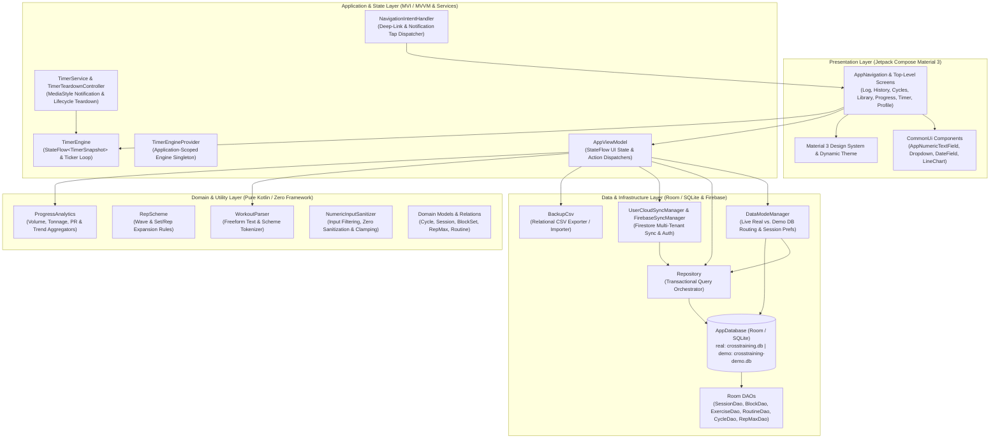
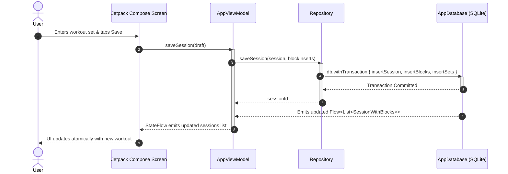

# Architecture & Engineering Standards (`.graph/architecture.md`)

**Repository**: `AntaresAndBharani/crosstrainingapp`  
**System**: CrossTraining Mobile Android Application (`com.fractanomics.crosstraining`)  
**Status**: Living Architecture Standard (Weekly Synchronized)  
**Target Runtime**: Android (minSdk 26, targetSdk 35, compileSdk 35) | Kotlin JVM 17  

---

## 🏛️ System Overview & Technology Stack

### System Overview
`crosstrainingapp` (CrossTraining) is an offline-first, high-performance Android training and strength progression tracker designed for CrossFit athletes, Olympic weightlifters, and coaches. It enables users to program, log, and analyze complex strength routines (e.g. *Clean + Hang Clean + Push Jerk*, *Snatch 3-2-1 waves @ E3MOM*), monitor periodized training cycles with target goals, track rep-max (PR) records across barbell and monostructural exercises, and execute timed interval workouts with background-resilient audio and media controls.

The architecture is built upon five fundamental pillars:
1. **Offline-First & Local-First Single Source of Truth (SSOT)**: Local persistence is managed by SQLite via Android Room with compile-time query verification, reactive `Flow` emissions, and transactional integrity (`withTransaction`). The core application operates with zero latency and full functionality without network connectivity.
2. **Dual Database Sandboxing (`DataModeManager`)**: The system enforces physical separation between real user training data (`crosstraining.db`) and disposable demo/sandbox data (`crosstraining-demo.db`). Mode switches occur live without application restart, ensuring evaluation and onboarding flows never mutate or corrupt personal workout history.
3. **Hybrid Cloud Sync & Community Sharing**: Non-blocking asynchronous backup, restore, routine sharing, and cross-device synchronization are facilitated via Firebase Authentication, Firestore environment namespaces (`environments/{APP_ENV}/...`), and AndroidX Credential Manager / Google Sign-In.
4. **Shared Foreground Engine Hoisting (`TimerEngine`)**: The interval workout timer subsystem is hoisted to the application lifecycle via `TimerEngineProvider`, seamlessly binding foreground UI (`TimerScreen`) and background execution (`TimerService`) with `MediaStyle` notification controls and graceful teardown (`TimerTeardownController`).
5. **Unidirectional Data Flow (UDF) & MVI/MVVM**: Strict unidirectional state flow powered by Kotlin Coroutines, `StateFlow`, and Jetpack Compose Material 3 UI.



---

### Technology Stack Matrix

| Layer / Concern | Technology | Version / Standard | Rationale |
|---|---|---|---|
| **Language & Platform** | Kotlin | `2.0.21` (JVM 17 Target) | Strong typing, coroutines, pattern matching, Kotlin K2 compiler support, value classes. |
| **Android Framework** | Android SDK | `minSdk 26`, `targetSdk 35`, `compileSdk 35` | Modern Android 14/15 compatibility, edge-to-edge layout enforcement, backward compatibility to Android 8.0 Oreo. |
| **Build & Tooling** | Android Gradle Plugin (AGP) + KSP | AGP `8.7.2`, KSP `2.0.21-1.0.28` | Kotlin DSL (`build.gradle.kts`), version catalogs (`libs.versions.toml`), high-performance Kotlin Symbol Processing. |
| **UI Toolkit & Design System** | Jetpack Compose + Material 3 | Compose BOM `2024.10.01`, Material 3 | Declarative UI, reactive state binding, Material You color schemes, dynamic light/dark theming. |
| **Navigation & Routing** | Navigation Compose | `2.8.4` | Single-activity architecture (`MainActivity`), type-safe arguments, deep-linking integration, drawer routing. |
| **Concurrency & Async** | Kotlin Coroutines & Flow | Coroutines `1.9.0`, Flow (`StateFlow`, `flatMapLatest`) | Structured concurrency, reactive data pipelines, cancellation propagation, main-safe I/O dispatching. |
| **Local Persistence** | Android Room | `2.6.1` (KSP) | Compile-time SQL validation, reactive query flows, multi-entity relationships (`@Relation`, `@Embedded`), atomic transactions (`withTransaction`). |
| **Background Execution & Media** | Android Foreground Service + MediaCompat | `androidx.media:media:1.7.0` | Foreground execution guarantee across Android 14+, interactive `MediaStyle` notification with `MediaSessionCompat` actions. |
| **Cloud & Identity** | Firebase BoM + Play Services | Firebase BoM `33.9.0`, Play Services Auth `21.3.0`, Credentials `1.3.0` | Multi-environment Firestore schema, Google Sign-In, anonymous/email authentication, remote routine catalog. |
| **Unit & Integration Testing** | JUnit 4 + Coroutines Test | JUnit `4.13.2`, `kotlinx-coroutines-test 1.9.0` | Fast, deterministic JVM unit tests for ViewModels, DAOs, parsers, services, and formatters. |
| **End-to-End Testing** | Maestro UI Automation | Maestro CLI (`e2e/*.yaml`) | Declarative, cross-platform UI integration flows validating user journeys and visual snapshots. |
| **CI/CD & Automation** | GitHub Actions Workflows | `.github/workflows/*.yml` | Automated PR verification (`build.yml`), snapshot APK generation, and release-signed production builds (`release.yml`). |

---

## 🧱 Layer Boundaries & Clean Architecture (Domain, Data, Presentation/UI separation of concerns)

The architecture adheres to a strict **Concentric Clean Architecture (Hexagonal / Ports and Adapters)** model. Dependencies point strictly **inward** toward domain abstractions and business logic. Presentation and Infrastructure layers are decoupled from domain models, ensuring that business rules, parsers, and calculation engines remain 100% testable in pure JVM environments without Android runtime dependencies.

```mermaid
graph TD
    subgraph Layer 4: Presentation & UI Adapters
        Screens["Compose Screens (`ui/screens/*`)"]
        Components["Reusable UI (`ui/components/*`)"]
        Nav["Navigation (`ui/navigation/*`)"]
        Activity["MainActivity"]
    end

    subgraph Layer 3: Application & Background State
        ViewModel["AppViewModel (`ui/AppViewModel.kt`)"]
        TimerEngine["TimerEngine & Provider (`ui/timer/*`)"]
        TimerService["TimerService & TeardownController (`ui/timer/*`)"]
        NavHandler["NavigationIntentHandler (`ui/navigation/*`)"]
    end

    subgraph Layer 2: Data & Persistence Infrastructure
        Repository["Repository (`data/Repository.kt`)"]
        DataMode["DataModeManager (`data/DataModeManager.kt`)"]
        RoomDB["AppDatabase & DAOs (`data/AppDatabase.kt`, `data/dao/*`)"]
        FirebaseSync["UserCloudSync & FirebaseSync (`data/firebase/*`)"]
        Backup["BackupCsv (`data/Backup.kt`)"]
    end

    subgraph Layer 1: Domain Core & Pure Utilities
        DomainModels["Entities & Relations (`data/model/*`)"]
        WorkoutParser["WorkoutParser (`util/WorkoutParser.kt`)"]
        RepScheme["RepScheme (`util/RepScheme.kt`)"]
        Analytics["ProgressAnalytics (`ui/ProgressAnalytics.kt`)"]
        Sanitizer["NumericInputSanitizer (`ui/components/CommonUi.kt`)"]
    end

    Layer 4 --> Layer 3
    Layer 3 --> Layer 2
    Layer 3 --> Layer 1
    Layer 2 --> Layer 1
```

### Layer Separation of Concerns

#### 1. Domain Core & Pure Utilities Layer
- **Package**: `com.fractanomics.crosstraining.util`, `com.fractanomics.crosstraining.data.model`, `com.fractanomics.crosstraining.ui.ProgressAnalytics`
- **Responsibilities**:
  - Encapsulates pure domain models (`Cycle`, `Session`, `SessionBlock`, `BlockSet`, `Exercise`, `Routine`, `RepMax`, `CycleGoal`).
  - Implements deterministic parsers: `WorkoutParser` (converts strings like `"Clean & Jerk 5x3 @ 80-100kg E2MOM"` into structured entities) and `RepScheme` (parses wave schemes like `"3-2-1-3-2-1"`).
  - Implements performance analytics: `ProgressAnalytics` calculates tonnage volume, daily bests, and working set averages without database or UI bindings.
  - Implements numeric input sanitization rules: `NumericInputSanitizer` cleans leading zeros, manages decimal precision, and bounds values.
- **Strict Boundary**: **Zero Android SDK imports** (no `Context`, `View`, `Composable`, `Service`, `Bundle`). Pure Kotlin standard library only.

#### 2. Data & Persistence Infrastructure Layer
- **Package**: `com.fractanomics.crosstraining.data`, `com.fractanomics.crosstraining.data.dao`, `com.fractanomics.crosstraining.data.firebase`
- **Responsibilities**:
  - Houses the SQLite persistence layer via Room (`AppDatabase`, `SessionDao`, `BlockDao`, `ExerciseDao`, `RoutineDao`, `CycleDao`, `RepMaxDao`, `CycleGoalDao`).
  - Exposes transactional boundaries through `Repository`, executing multi-table mutations inside `db.withTransaction`.
  - Manages dual-database routing and preferences through `DataModeManager` (toggling between `AppDatabase.get()` and `AppDatabase.demo()`).
  - Provides cloud serialization and multi-tenant synchronization with Firebase Firestore and Google Auth via `UserCloudSyncManager` and `FirebaseSyncManager`.
  - Encodes and decodes relational database backups via `BackupCsv`.
- **Strict Boundary**: Never references UI Composables, ViewModels, or Navigation graphs. Exposes reactive streams as immutable Kotlin `Flow<T>`.

#### 3. Application & Background State Layer
- **Package**: `com.fractanomics.crosstraining.ui`, `com.fractanomics.crosstraining.ui.timer`, `com.fractanomics.crosstraining.ui.navigation`
- **Responsibilities**:
  - `AppViewModel`: Manages UI state lifecycles, collects repository flows, and exposes immutable `StateFlow<T>` streams to the presentation layer. Handles asynchronous job launches within `viewModelScope`.
  - `TimerEngine`: Hoisted via `TimerEngineProvider` to provide an app-scoped, single-source-of-truth interval workout timer emitting `StateFlow<TimerSnapshot>`.
  - `TimerService` & `TimerTeardownController`: Foreground service orchestrating interactive `MediaStyle` notifications backed by `MediaSessionCompat`. Ensures clean service teardown without notification or memory leaks upon timer completion, stop, or reset.
  - `NavigationIntentHandler`: Extracts intent payloads from notification taps and cold-start intents to drive navigation routes.
- **Strict Boundary**: ViewModels never hold `Context` references; services communicate with UI solely through shared reactive state (`StateFlow`) and intents.

#### 4. Presentation & UI Layer
- **Package**: `com.fractanomics.crosstraining.ui.screens`, `com.fractanomics.crosstraining.ui.components`, `com.fractanomics.crosstraining.ui.theme`
- **Responsibilities**:
  - Declarative Jetpack Compose UI representing screens: `LogSessionScreen`, `HistoryScreen`, `SessionEditorScreen`, `ProgressScreen`, `CyclesScreen`, `LibraryScreen`, `TimerScreen`, `ProfileScreen`, `LoginWelcomeScreen`.
  - Reusable UI primitives: `AppNumericTextField` (deferred commit, select-all on focus, intermediate blank tolerance), `DateField`, `Dropdown`, `LineChart`, `SectionCard`, `ScreenList`.
  - Design system: Material 3 color palettes, typography, dynamic light/dark theme switching, and role-based navigation layouts (Athlete vs. Coach).
- **Strict Boundary**: Stateless composables. All state is hoisted; user interactions trigger lambda callbacks (`onAction`, `onNavigate`) directed upward to the ViewModel.

---

## 📁 Directory & Package Structure Guidelines

```text
crosstrainingapp/
├── .github/                              # CI/CD Workflows, Issue Templates & Prompts
│   ├── workflows/                        # GitHub Actions automated pipelines
│   │   ├── build.yml                     # PR build, script verification & unit test CI
│   │   ├── release.yml                   # Production tag, release signing & APK publication
│   │   ├── architect.yml                 # Autonomous living architecture synchronization
│   │   └── three-amigos.yml              # Autonomous story triage & test verification
│   └── ISSUE_TEMPLATE/                   # Structured user story and subtask templates
├── .graph/                               # Living Architecture & Engineering Governance
│   └── architecture.md                   # Master Living Architecture Document (this file)
├── app/                                  # Primary Android Application Module
│   ├── build.gradle.kts                  # Module build configuration, SDKs & dependencies
│   ├── proguard-rules.pro                # R8 / ProGuard optimization rules
│   └── src/
│       ├── main/
│       │   ├── AndroidManifest.xml       # App declarations, permissions & services
│       │   ├── java/com/fractanomics/crosstraining/
│       │   │   ├── CrossTrainingApp.kt   # Application class (owns DataModeManager & TimerEngine)
│       │   │   ├── MainActivity.kt       # Single-activity container & intent handler
│       │   │   ├── data/                 # Persistence & Data Infrastructure
│       │   │   │   ├── AppDatabase.kt    # Room database declaration & singleton builders
│       │   │   │   ├── Backup.kt         # CSV backup exporter / importer
│       │   │   │   ├── Converters.kt     # Room type converters (LocalDate, Enums)
│       │   │   │   ├── DataModeManager.kt# Real vs Demo DB manager & SharedPreferences
│       │   │   │   ├── DemoData.kt       # Deterministic demo dataset generator
│       │   │   │   ├── Repository.kt     # Unified transactional repository
│       │   │   │   ├── SeedData.kt       # Initial movement & routine catalog seed
│       │   │   │   ├── dao/              # Room Data Access Objects
│       │   │   │   │   ├── BlockDao.kt
│       │   │   │   │   ├── CycleDao.kt
│       │   │   │   │   ├── CycleGoalDao.kt
│       │   │   │   │   ├── ExerciseDao.kt
│       │   │   │   │   ├── RepMaxDao.kt
│       │   │   │   │   ├── RoutineDao.kt
│       │   │   │   │   └── SessionDao.kt
│       │   │   │   ├── firebase/         # Cloud Sync & Identity Adapters
│       │   │   │   │   ├── FirebaseSyncManager.kt
│       │   │   │   │   └── UserCloudSyncManager.kt
│       │   │   │   └── model/            # Room Entities & Relational Data Classes
│       │   │   │       ├── BlockSet.kt
│       │   │   │       ├── Cycle.kt
│       │   │   │       ├── CycleGoal.kt
│       │   │   │       ├── Enums.kt      # ExerciseCategory, MetricType, BlockKind
│       │   │   │       ├── Exercise.kt
│       │   │   │       ├── Relations.kt  # BlockWithSets, SessionWithBlocks, RoutineWithBlocks
│       │   │   │       ├── RepMax.kt
│       │   │   │       ├── Routine.kt
│       │   │   │       ├── RoutineBlock.kt
│       │   │   │       ├── Session.kt
│       │   │   │       ├── SessionBlock.kt
│       │   │   │       └── UserRole.kt
│       │   │   ├── ui/                   # UI Presentation & State Management
│       │   │   │   ├── AppViewModel.kt   # Master ViewModel backing screens & flows
│       │   │   │   ├── Format.kt         # Date & numeric string formatters
│       │   │   │   ├── ProgressAnalytics.kt # Volume, tonnage & PR analytics
│       │   │   │   ├── SessionDraft.kt   # Mutable in-memory session editing models
│       │   │   │   ├── components/       # Reusable Compose Primitives
│       │   │   │   │   ├── CommonUi.kt   # AppNumericTextField, SectionCard, ScreenList
│       │   │   │   │   ├── DateField.kt
│       │   │   │   │   ├── Dropdown.kt
│       │   │   │   │   ├── LineChart.kt
│       │   │   │   │   └── QuickAddWorkoutDialog.kt
│       │   │   │   ├── navigation/       # Navigation & Intent Routing
│       │   │   │   │   ├── AppNavigation.kt # NavHost, BottomBar, Drawer & Role Switcher
│       │   │   │   │   └── NavigationIntentHandler.kt
│       │   │   │   ├── screens/          # Top-Level Jetpack Compose Screens
│       │   │   │   │   ├── CyclesScreen.kt
│       │   │   │   │   ├── HistoryScreen.kt
│       │   │   │   │   ├── LibraryScreen.kt
│       │   │   │   │   ├── LoginWelcomeScreen.kt
│       │   │   │   │   ├── LogSessionScreen.kt
│       │   │   │   │   ├── ProfileScreen.kt
│       │   │   │   │   ├── ProgressScreen.kt
│       │   │   │   │   ├── SessionEditor.kt
│       │   │   │   │   └── TimerScreen.kt
│       │   │   │   ├── theme/            # Compose Theme, Color Palettes & Typography
│       │   │   │   │   ├── Color.kt
│       │   │   │   │   ├── Theme.kt
│       │   │   │   │   └── Type.kt
│       │   │   │   └── timer/            # Workout Timer Background Subsystem
│       │   │   │       ├── TimerEngine.kt
│       │   │   │       ├── TimerEngineProvider.kt
│       │   │   │       ├── TimerNotificationFormatter.kt
│       │   │   │       ├── TimerService.kt
│       │   │   │       ├── TimerTeardownController.kt
│       │   │   │       └── WorkoutTimer.kt
│       │   │   └── util/                 # Pure Business Utilities & Parsers
│       │   │       ├── RepScheme.kt      # Wave & rep scheme expansion rules
│       │   │       └── WorkoutParser.kt  # Freeform workout text parser
│       │   └── res/                      # Android resources (drawables, mipmaps, values)
│       └── test/java/com/fractanomics/crosstraining/ # JVM Unit Tests
│           ├── data/                     # Repository & Database Model Tests
│           ├── ui/                       # ViewModel & Component Tests
│           │   ├── components/           # AppNumericTextField Unit Tests
│           │   ├── screens/              # Screen Migration Tests
│           │   ├── theme/                # Theme Mode Tests
│           │   └── timer/                # TimerEngine, TimerService & Teardown Tests
│           └── util/                     # WorkoutParser & RepScheme Tests
├── e2e/                                  # Maestro E2E Integration Test Flows
├── gradle/                               # Gradle Wrapper & Version Catalog
│   ├── libs.versions.toml                # Centralized dependency management
│   └── wrapper/
├── scripts/                              # Developer & CI Automation Scripts
│   ├── run-e2e-tests.ps1                 # Maestro E2E executor & artifact capturer
│   └── tests/Invoke-ScriptTests.ps1      # Cross-platform script test harness
├── build.gradle.kts                      # Root Gradle build script
├── CHANGELOG.md                          # Historical record of changes (Keep a Changelog)
├── GEMINI.md                             # Agent workspace guidelines & quick commands
└── README.md                             # Project overview & build instructions
```

### Module Responsibilities & Conventions
- **One Responsibility Per Package**: Subpackages in `data/`, `ui/`, and `util/` must have clear boundaries. Domain calculation logic belongs in `util/` or pure data helpers, never inside Composable functions.
- **Naming Conventions**:
  - Top-level navigable screens end in `*Screen.kt` (e.g. `LogSessionScreen.kt`, `CyclesScreen.kt`).
  - Database access interfaces end in `*Dao.kt` (e.g. `SessionDao.kt`).
  - Unit tests end in `*Test.kt` (e.g. `TimerEngineTest.kt`, `AppNumericTextFieldTest.kt`).
  - Reusable Compose components are placed in `ui/components/` with stateless parameter signatures.
- **Stateless Composable Architecture**: Every Composable must receive its data as immutable state parameters and emit events via lambda parameters (e.g. `onValueChange: (String) -> Unit`, `onSave: () -> Unit`).

---

## 🎨 Design Patterns, State Management & Dependency Injection

### 1. Unidirectional Data Flow (UDF) & MVI State Pattern
The application strictly enforces Unidirectional Data Flow (UDF):
- **State flows DOWN**: The `AppViewModel` collects repository flows, combines them with UI preferences, and exposes immutable `StateFlow<T>` streams. Composables consume these streams using `collectAsStateWithLifecycle()`, guaranteeing that stream collection automatically suspends when the Composable is off-screen.
- **Events flow UP**: User interactions (button taps, text inputs, deletions) are passed up to the ViewModel as lambda invocations (`saveSession()`, `setThemeMode()`, `recordRepMax()`), which dispatch asynchronous operations on `viewModelScope`.



### 2. Live Dual-Database Routing (`DataModeManager`)
To provide safe exploration without risking real athlete data, `DataModeManager` maintains two distinct database instances:
- `AppDatabase.get(context)` → Production database (`crosstraining.db`).
- `AppDatabase.demo(context)` → Sandbox database (`crosstraining-demo.db`) seeded with realistic multi-cycle CrossFit and weightlifting history (`DemoData.kt`).

`AppViewModel` binds all reactive flows through `data.repositoryFlow.flatMapLatest { ... }`:
```kotlin
val sessions: StateFlow<List<SessionWithBlocks>> =
    data.repositoryFlow.flatMapLatest { it.allSessions }.stateInDefault(emptyList())
```
When the user toggles demo mode in the UI, `_demoMode` updates, causing `repositoryFlow` to emit the new repository instance. `flatMapLatest` immediately cancels previous database observers and re-binds the entire UI hierarchy to the newly selected database in real time.

### 3. Application-Scoped Shared Engine Provider (`TimerEngineProvider`)
The workout timer is an interactive engine that must operate continuously regardless of screen navigation or activity destruction.
- `TimerEngineProvider` maintains a thread-safe application-scoped singleton instance of `TimerEngine`.
- Both `TimerScreen` (foreground Compose UI) and `TimerService` (background foreground service) bind to the exact same `TimerEngine.snapshot` `StateFlow`.
- Controlling the timer in the notification (`Play`, `Pause`, `Next`, `Stop`) or in the UI updates the shared snapshot synchronously.

```kotlin
object TimerEngineProvider {
    @Volatile
    private var instance: TimerEngine? = null

    fun get(context: Context): TimerEngine {
        return instance ?: synchronized(this) {
            instance ?: TimerEngine(context.applicationContext).also { instance = it }
        }
    }
}
```

### 4. Graceful Foreground Lifecycle & Teardown Controller (`TimerTeardownController`)
Foreground services managing media notifications are susceptible to memory leaks, notification lingering, and orphaned audio sessions if not terminated cleanly.
- `TimerTeardownController` abstracts and enforces the four-step graceful termination sequence:
  1. `ServiceCompat.stopForeground(STOP_FOREGROUND_REMOVE)` to detach foreground status.
  2. `NotificationManagerCompat.cancel(NOTIFICATION_ID)` to dismiss notification trays.
  3. `MediaSessionCompat.release()` to deallocate media session tokens and callbacks.
  4. `Service.stopSelf()` to terminate the service process cleanly.
- Teardown triggers deterministically on: explicit stop action (`ACTION_STOP`), timer reset (`TimerEngine.reset()`), or natural timer completion (`TimerPhase.FINISHED`).

### 5. Resilient Numeric Input Component Pattern (`AppNumericTextField`)
Standard `OutlinedTextField` with numeric strings causes critical user experience defects in mobile fitness trackers: typing into existing numbers can concatenate digits (e.g. typing `"6"` into cleared `"10"` producing `"610"`), backspacing can snap back if empty strings are rejected, and keyboard actions can fail to commit clamped bounds.

`AppNumericTextField` solves this with a robust component contract:
- **Select-All on Focus**: When the field gains focus, `selection` is set to `TextRange(0, text.length)`, allowing immediate digit replacement.
- **Intermediate Blank State**: Allows `""` while actively focused without snapping back to previous values.
- **Deferred Commit & Clamping**: Clamps to `minValue..maxValue` and sanitizes leading zeros (e.g. `"05"` -> `"5"`) strictly upon focus loss (`onFocusChanged`) or keyboard IME action (`Done`/`Next`).
- **Sanitizer Extraction**: Input filtering logic is decoupled into the pure `NumericInputSanitizer` object for 100% JVM test coverage.

### 6. Domain Strategy & Rule-Based Parsing Engine (`WorkoutParser` & `RepScheme`)
Fitness tracking demands high data entry speed. `WorkoutParser` uses structured regex tokenization to transform natural workout strings into relational domain models:
- Formats: Detects `E1MOM`, `E2MOM`, `AMRAP 15`, `FOR TIME`, `TABATA`, `REST 2 min`.
- Schemes: Expands `5x3` into 5 sets of 3 reps, `3-2-1-3-2-1` into wave-loaded sets, and `60-80` into linearly stepped weight ranges (`[60.0, 65.0, 70.0, 75.0, 80.0]`).
- Matching: Fuzzy matches against existing user `Exercise` and `Routine` entities before creating new catalog entries.

### 7. Dependency Injection via Composition Root
The application utilizes constructor injection wired via composition roots:
- `CrossTrainingApp` instantiates `DataModeManager` and `TimerEngine`.
- `MainActivity` creates `AppViewModel` using `AppViewModel.factory(dataModes)`.
- Components and screens receive dependencies explicitly via constructor parameters, enabling seamless mock substitution in unit tests.

---

## 🚫 Architectural Constraints & Anti-Patterns

### Strict Architectural Constraints
1. **No Android Framework / UI Bleed into Domain Utilities**:
   - `WorkoutParser`, `RepScheme`, `ProgressAnalytics`, and `NumericInputSanitizer` must never import Android classes (`android.*`, `androidx.compose.*`).
   - All domain calculations must execute deterministically on any standard JVM.
2. **Strict Unidirectional Data Flow (UDF)**:
   - Composables must never mutate ViewModel state or repository data directly.
   - Child components must not receive the `AppViewModel` instance directly; pass only the minimal required immutable state and event lambdas.
3. **Physical Database Isolation**:
   - Real user data and Demo data must never reside in the same SQLite file.
   - All persistence switches must route through `DataModeManager`.
4. **Zero Resource Leaks in Foreground Services**:
   - Every foreground service must register an explicit notification channel (`NotificationManager.IMPORTANCE_LOW`).
   - Every background service must manage `MediaSessionCompat` and foreground states using `TimerTeardownController`.
5. **No Main-Thread Blocking (Main-Safety)**:
   - Database reads/writes, CSV serialization, and network sync operations must execute on `Dispatchers.IO` via coroutine builders (`viewModelScope.launch`, `withContext(Dispatchers.IO)`).
6. **Atomic Transaction Gating**:
   - Any multi-entity mutation (e.g. saving a session with nested blocks and sets, or importing backup snapshots) must be enclosed within `db.withTransaction`.

### Anti-Pattern Reference Matrix

| Anti-Pattern | Architectural Violation | Mandated Clean Solution |
|---|---|---|
| **Ad-hoc String State Numeric Inputs** | Using raw `String` state with standard `OutlinedTextField`, causing digit concatenation (`"610"` bug) and blocking decimals. | Use `AppNumericTextField` with `NumericInputSanitizer` for focus select-all, intermediate blanks, and deferred clamping. |
| **Direct DAO Access in UI** | Composables querying or writing to Room DAOs directly, breaking testability and bypassing UDF. | Route all data access through `AppViewModel` and `Repository`. |
| **Passing ViewModel to Leaf Composables** | Passing `AppViewModel` down component hierarchies, coupling UI widgets to the entire application state. | Pass only specific immutable state models and lambda callbacks (`(Value) -> Unit`). |
| **Zombie Foreground Notifications** | Terminating a timer service with `stopSelf()` without releasing `MediaSessionCompat` or cancelling notifications. | Use `TimerTeardownController.performGracefulTeardown()` on stop, reset, and completion. |
| **Framework Bleed into Domain** | Importing Android `Context` or Compose `State` inside `WorkoutParser` or `ProgressAnalytics`. | Keep domain modules pure Kotlin; perform context resolution and formatting in the Presentation layer. |
| **Mixed Real & Demo Records** | Flagging demo rows with an `isDemo` boolean in the production database. | Physical database isolation via `DataModeManager` pointing to separate SQLite files. |
| **Hardcoded Machine Paths in Gradle** | Adding local Windows `org.gradle.java.home` to repository `gradle.properties`. | Machine-specific paths belong in `~/.gradle/gradle.properties`; keep repository configuration portable. |

---

## 📋 Definition of Done (DoD) for Architecture & Code Quality

When implementing features, refactoring subsystems, or updating architecture:
1. **Local Automated Test Verification**:
   - Android JVM unit test suite passes 100% green (`.\gradlew.bat testDebugUnitTest --no-daemon`).
   - Script verification suite passes (`.\scripts\tests\Invoke-ScriptTests.ps1`).
   - Fast lint check passes (`.\gradlew.bat lintDebug --no-daemon`).
2. **E2E Visual Regression Verification**:
   - For UI modifications, execute Maestro E2E test flows (`.\scripts\run-e2e-tests.ps1`) and verify that visual snapshots in `docs/screenshots/` remain consistent.
3. **Living Documentation & Changelog Maintenance**:
   - Maintain `.graph/architecture.md` to reflect any architectural patterns, service contracts, or schema changes.
   - Add a descriptive entry under `## [Unreleased]` in `CHANGELOG.md` adhering to the Keep a Changelog standard.
4. **Git Branch & Pull Request Standards**:
   - Create a feature branch `feat/[task-summary]` branched from `main`.
   - Open a Pull Request on GitHub with a comprehensive Mission Plan description.
5. **Remote CI / CD Quality Gate (100% Green)**:
   - Verify that all GitHub Actions CI checks (`build.yml`, `release.yml`) pass with zero errors.
   - Confirm that the PR Snapshot build artifact (`crosstraining-snapshot.apk`) is published before merging.
