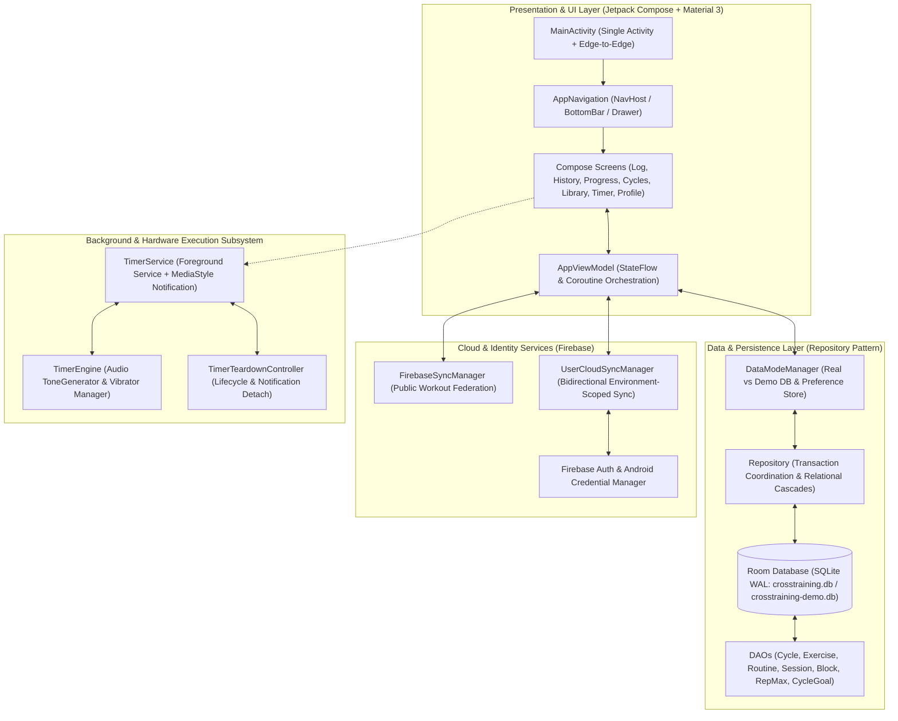
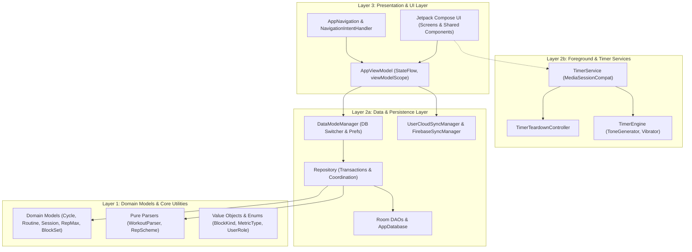
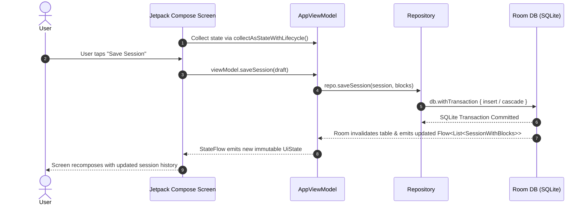

# Architecture & Engineering Standards (`.graph/architecture.md`)

**Repository**: `AntaresAndBharani/crosstrainingapp`  
**System**: CrossTraining Mobile Application (`com.fractanomics.crosstraining`)  
**Status**: Living Architecture Standard (Continuously Synchronized)  
**Target Platform**: Android 15 (API 35) | Kotlin 2.0.21 | JVM 17  

---

## 🏛️ System Overview & Technology Stack

### System Overview
`crosstrainingapp` is a modern, offline-first native Android application engineered for elite strength and conditioning athletes, coaches, and functional fitness practitioners. The platform delivers real-time workout tracking, multi-block training logging, cycle periodization, 1RM (Rep-Max) analytics, background interval timers, and cloud-synced workout sharing.

The architecture emphasizes **Zero-Latency Local Persistence**, **Unidirectional Data Flow (UDF)**, and **Strict Sandbox Isolation**:
1. **Local-First Single Source of Truth**: All operational state and workout history live in a high-performance SQLite database via Room with reactive Kotlin `Flow` streams.
2. **Dual-Database Mode Architecture**: An isolated physical database switching mechanism allows users to explore complete sample datasets (`crosstraining-demo.db`) without mutating production user records (`crosstraining.db`).
3. **Continuous Background Interval Engine**: A robust foreground service (`TimerService`) with `MediaStyle` notifications and audio/haptic cues operates independently of UI lifecycle states.
4. **Cloud Synchronization & Federation**: Asynchronous sync with Firebase Firestore and Authentication (including Google Credential Manager), isolated by deployment environment (`snapshot` vs `production`).



---

### Technology Stack Matrix

| Layer / Concern | Technology | Version / Standard | Rationale |
|---|---|---|---|
| **Platform SDK** | Android SDK | `compileSdk = 35`, `targetSdk = 35`, `minSdk = 26` | Modern Android 15 capabilities, predictive back gesture support, and edge-to-edge system bars. |
| **Runtime & Language** | Kotlin | `2.0.21` (JVM 17 Target) | Kotlin 2.0 compiler pipeline, modern language idioms, fast compile times, and full JVM 17 standard library features. |
| **Build & Annotation** | Gradle Kotlin DSL + KSP | AGP `8.7.2`, KSP `2.0.21-1.0.28` | Declarative `build.gradle.kts` configuration, type-safe version catalogs (`libs.versions.toml`), and fast Kotlin Symbol Processing for Room. |
| **UI Toolkit** | Jetpack Compose | Compose BOM `2024.10.01` (Kotlin Compose Plugin) | Declarative reactive UI, zero XML view overhead, fine-grained recomposition, and native dynamic color theming. |
| **Design System** | Material 3 (M3) | `androidx.compose.material3:material3` | Material You tokens, dynamic light/dark theming (`AppThemeMode`), accessible typography, and standard components. |
| **Concurrency & Streams** | Kotlin Coroutines & Flow | `kotlinx-coroutines 1.9.0` | Non-blocking asynchronous programming, structured concurrency with `viewModelScope`, and hot/cold reactive data streams. |
| **State Observation** | Lifecycle Compose | `lifecycle-runtime-compose:2.8.7` | `collectAsStateWithLifecycle()` ensures zero UI state collection when composables are inactive or backgrounded. |
| **Local Database** | Room | `room 2.6.1` (KSP) | Type-safe SQL abstraction, reactive Flow queries, ACID transaction support (`withTransaction`), and schema migration safety. |
| **Background Execution** | Android Foreground Service + MediaStyle | `androidx.media:media:1.7.0` | Uninterruptible timer execution during device lock/backgrounding with lock-screen MediaSession transport controls. |
| **Cloud & Federation** | Firebase BoM | `firebase-bom:33.9.0` (Firestore, Auth, Analytics) | Scalable NoSQL cloud backup, real-time sync across devices, anonymous auth fallback, and routine sharing. |
| **Identity & Authentication** | Credential Manager | `androidx.credentials:1.3.0`, `googleid:1.1.1` | Passkey-ready, seamless Google One-Tap sign-in with persistent local session caching. |
| **Testing Framework** | JUnit 4 + Coroutines Test + Pester | `junit:4.13.2`, `kotlinx-coroutines-test:1.9.0` | Comprehensive JVM unit testing for viewmodels, parsers, and timer state machines; Pester for CI automation scripts. |

---

## 🧱 Layer Boundaries & Clean Architecture (Separation of Concerns)

The codebase strictly adheres to **Clean Architecture** and **Unidirectional Data Flow (UDF)**. Dependencies strictly flow inward: **UI Layer -> ViewModel -> Repository -> Room / Remote Data Sources**.



### Layer Responsibilities

#### 1. Domain & Core Utilities Layer (`data.model`, `util`)
- **Entities & Relations**: Plain Kotlin data classes (`Cycle`, `Exercise`, `Routine`, `Session`, `SessionBlock`, `BlockSet`, `RepMax`, `CycleGoal`).
- **Composite Relations**: Read-only models combining parent-child relations with Room annotations (`RoutineWithBlocks`, `SessionWithBlocks`, `CycleWithGoals`).
- **Pure Functional Logic**:
  - `WorkoutParser`: Tokenizes and parses freeform workout shorthand (e.g. `"Snatch 5x3 @ 60, 65, 70 kg E2MOM"`) into structured blocks, exercises, and sets without side effects.
  - `RepScheme`: Evaluates rep schemes (waves, fixed reps, NxM sequences) into discrete set lists.
- **Constraints**: **Zero dependencies** on Android UI packages, ViewModels, or Room DAOs.

#### 2. Data & Persistence Layer (`data`, `data.dao`, `data.firebase`)
- **Database & DAOs**: Room SQLite database with Write-Ahead Logging (WAL). DAOs return cold `Flow<T>` for observation and suspend functions for atomic single-shot operations.
- **Repository (`Repository.kt`)**:
  - The single source of truth and entry point for all data operations.
  - Encapsulates database transactions via `db.withTransaction { ... }`.
  - Enforces referential integrity on cascaded writes (e.g., sessions -> session blocks -> block sets -> rep maxes).
  - Handles CSV snapshot serialization and deserialization (`BackupCsv`).
- **DataModeManager (`DataModeManager.kt`)**:
  - Encapsulates dynamic switching between real database (`crosstraining.db`) and demo sandbox (`crosstraining-demo.db`).
  - Exposes `repositoryFlow: Flow<Repository>` to automatically re-bind all downstream UI state flows upon mode toggle.
  - Manages persistent app preferences (`SharedPreferences`): theme mode, user role (`ATHLETE` vs `COACH`), auth tokens.
- **Cloud Federation (`data.firebase`)**:
  - `UserCloudSyncManager`: Handles user-scoped bidirectional document synchronization across Firebase Firestore partitioned by environment namespaces.
  - `FirebaseSyncManager`: Manages routine publishing and code-based workout imports.

#### 3. Presentation & UI Layer (`ui`, `ui.screens`, `ui.components`, `ui.navigation`, `ui.theme`)
- **Single Activity Architecture**: `MainActivity` serves as the root window host, initializing edge-to-edge styling, root theme, and navigation.
- **Unified ViewModel (`AppViewModel.kt`)**:
  - Central reactive hub. Uses `flatMapLatest` on `data.repositoryFlow` to dynamically switch data sources without recreating ViewModels.
  - Emits immutable `StateFlow<T>` models wrapped in `stateIn(viewModelScope, SharingStarted.WhileSubscribed(5000), default)`.
- **Navigation (`AppNavigation.kt`, `NavigationIntentHandler.kt`)**:
  - Manages bottom bar tabs (`BottomDestination`) and drawer items (`DrawerItem`).
  - Supports cold/warm intent routing from notification taps directly to targeted destinations (e.g. Timer screen).
- **Design System & Components (`ui.components`, `ui.theme`)**:
  - `AppNumericTextField`: Standardized numeric input component providing auto-selection on focus, deferred commit on blur, decimal formatting, and error validation.
  - `LineChart`: Canvas-based data visualization for strength progression and volume tracking.

#### 4. Background Execution & Timer Subsystem (`ui.timer`)
- **TimerService (`TimerService.kt`)**:
  - Foreground service running an interactive `MediaStyle` notification.
  - Exposes pending intents for Play/Pause, Next Round, and Stop directly from the Android lock screen.
- **TimerTeardownController (`TimerTeardownController.kt`)**:
  - Coordinates graceful foreground service detachment, notification cancellation, and `MediaSessionCompat` cleanup upon timer completion or stop.
- **TimerEngine (`TimerEngine.kt`)**:
  - Thread-safe workout timer state machine emitting immutable `TimerSnapshot` flows.
  - Integrates low-latency audio tones (`ToneGenerator`) and multi-pattern haptics (`Vibrator` / `VibratorManager`).

---

## 📁 Directory & Package Structure Guidelines

```text
com.fractanomics.crosstraining/
├── CrossTrainingApp.kt              # Application subclass (Application Context & Lazy Singletons)
├── MainActivity.kt                  # Single Activity host (Edge-to-Edge, Intent routing, Theme wrapper)
│
├── data/                            # DATA LAYER: Persistence, Repositories, and Core Data Management
│   ├── AppDatabase.kt               # Room Database configuration, entity registry, and migration logic
│   ├── Backup.kt                    # CSV import/export encoder and decoder utilities
│   ├── Converters.kt                # Room TypeConverters (LocalDate, Enums, Lists)
│   ├── DataModeManager.kt           # Real vs Demo DB switcher, Preferences & Session storage
│   ├── DemoData.kt                  # Deterministic demo dataset generator
│   ├── Repository.kt                # Master data repository (Single point of database access)
│   ├── SeedData.kt                  # Initial starter exercise library and standard routines
│   │
│   ├── dao/                         # Room Data Access Objects (Reactive Flows & CRUD queries)
│   │   ├── BlockDao.kt              # Session blocks and block sets DAO
│   │   ├── CycleDao.kt              # Macro/mesocycle periodization DAO
│   │   ├── CycleGoalDao.kt          # Target weight and rep goals DAO
│   │   ├── ExerciseDao.kt           # Movement and exercise catalog DAO
│   │   ├── RepMaxDao.kt             # 1RM and historical personal records DAO
│   │   ├── RoutineDao.kt            # Routine templates and routine blocks DAO
│   │   └── SessionDao.kt            # Logged workout sessions DAO
│   │
│   ├── firebase/                    # CLOUD & FEDERATION: Firebase Auth and Firestore Cloud Sync
│   │   ├── FirebaseSyncManager.kt   # Public routine sharing and community workout discovery
│   │   └── UserCloudSyncManager.kt  # Environment-partitioned user backup and sync manager
│   │
│   └── model/                       # DOMAIN MODELS: Plain Kotlin Entities and Relations
│       ├── BlockSet.kt              # Individual work/warmup/failed set entity
│       ├── Cycle.kt                 # Training cycle entity
│       ├── CycleGoal.kt             # Cycle target goal entity
│       ├── Enums.kt                 # BlockKind, ExerciseCategory, MetricType
│       ├── Exercise.kt              # Exercise catalog entity
│       ├── Relations.kt             # Composite entities (RoutineWithBlocks, SessionWithBlocks, CycleWithGoals)
│       ├── RepMax.kt                # Repetition maximum entity
│       ├── Routine.kt               # Reusable routine template entity
│       ├── RoutineBlock.kt          # Block definition within a routine
│       ├── Session.kt               # Logged training session entity
│       ├── SessionBlock.kt          # Individual block within a logged session
│       └── UserRole.kt              # User permission profile (Athlete vs Coach)
│
├── ui/                              # PRESENTATION LAYER: UI, ViewModels, and State Management
│   ├── AppViewModel.kt              # Central ViewModel coordinating reactive UI state and data operations
│   ├── Format.kt                    # Number, date, weight, and duration formatting helpers
│   ├── ProgressAnalytics.kt         # Volume calculation, 1RM progression, and analytics logic
│   ├── SessionDraft.kt              # Editable draft state models for session logging
│   │
│   ├── components/                  # Reusable UI Widgets & Design System Components
│   │   ├── AppNumericTextField.kt   # Standard numeric/decimal text field with select-all and deferred commit
│   │   ├── CommonUi.kt              # Standard cards, badges, section headers, and chips
│   │   ├── DateField.kt             # Interactive date picker field
│   │   ├── Dropdown.kt              # Single and multi-select dropdown menus
│   │   ├── LineChart.kt             # Custom Canvas line chart for 1RM and volume progression
│   │   └── QuickAddWorkoutDialog.kt # Quick workout and exercise creation modal
│   │
│   ├── navigation/                  # Navigation & Routing Subsystem
│   │   ├── AppNavigation.kt         # Compose NavHost, BottomNavigation bar, and Navigation Drawer
│   │   └── NavigationIntentHandler.kt # Deep linking and notification intent dispatcher
│   │
│   ├── screens/                     # Feature Screens (Top-Level Composable Views)
│   │   ├── CyclesScreen.kt          # Training cycle management and goal tracking view
│   │   ├── HistoryScreen.kt         # Workout history calendar and session list view
│   │   ├── LibraryScreen.kt         # Exercise and routine library view (with Coach tools)
│   │   ├── LoginWelcomeScreen.kt    # Authentication, Google Sign-In, and Profile selection view
│   │   ├── LogSessionScreen.kt      # Quick session logging view
│   │   ├── ProfileScreen.kt         # User settings, theme mode, backup/restore, cloud sync view
│   │   ├── ProgressScreen.kt        # Analytics, 1RM charts, and volume metrics view
│   │   ├── SessionEditor.kt         # Comprehensive multi-block session creator/editor
│   │   └── TimerScreen.kt           # Interval, EMOM, AMRAP, and For-Time workout timer view
│   │
│   ├── theme/                       # Design System & Theming Tokens
│   │   ├── Color.kt                 # Color palette tokens (Dark and Light modes)
│   │   ├── Theme.kt                 # CrossTrainingTheme Material 3 composable wrapper
│   │   └── Type.kt                  # Typography definitions
│   │
│   └── timer/                       # Timer Subsystem & Background Hardware Engine
│       ├── TimerEngine.kt           # Core workout timer state machine and ticker
│       ├── TimerEngineProvider.kt   # Singleton provider for shared timer instance
│       ├── TimerNotificationFormatter.kt # Notification title, text, and subtext formatter
│       ├── TimerService.kt          # MediaStyle Foreground Service
│       ├── TimerTeardownController.kt # Deterministic service teardown and notification cleanup
│       └── WorkoutTimer.kt          # Timer configuration and snapshot data models
│
└── util/                            # CROSS-CUTTING DOMAIN UTILITIES
    ├── RepScheme.kt                 # Wave and fixed rep scheme parser and evaluator
    └── WorkoutParser.kt             # Freeform text tokenizer and workout syntax parser
```

---

## 🎨 Design Patterns, State Management & Dependency Injection

### 1. Unidirectional Data Flow (UDF) & State Hoisting
State always flows down to composables, and user events always flow up to the ViewModel:



### 2. Live Reactive Repository Switching (`flatMapLatest`)
When the user toggles between Real and Demo data modes, the application updates all active UI flows live without recreating the ViewModel or restarting the Activity:

```kotlin
// AppViewModel.kt
val sessions: StateFlow<List<SessionWithBlocks>> =
    data.repositoryFlow
        .flatMapLatest { it.allSessions }
        .stateIn(viewModelScope, SharingStarted.WhileSubscribed(5_000), emptyList())
```

### 3. Composition Root & Factory-Based Dependency Injection
The application utilizes a lightweight, transparent Composition Root pattern without heavy reflection frameworks:
- `CrossTrainingApp` owns singleton instances of `DataModeManager` and `TimerEngine`.
- `MainActivity` resolves `dataModes` from `application` and instantiates `AppViewModel` via `AppViewModel.factory(dataModes)`.
- Composables receive the shared `AppViewModel` or stateless lambdas, enabling rapid previewing and isolated UI unit testing.

### 4. Deterministic Service Teardown Pattern (`TimerTeardownController`)
To prevent zombie foreground services, lingering lockscreen notifications, or leaked `MediaSessionCompat` instances, teardown logic is isolated into a testable controller:

```kotlin
// TimerTeardownController.kt
class TimerTeardownController(
    private val onStopForeground: (removeNotification: Boolean) -> Unit,
    private val onDismissNotification: () -> Unit,
    private val onReleaseMediaSession: () -> Unit,
    private val onStopService: () -> Unit
) {
    fun teardown(reason: TeardownReason) {
        onStopForeground(true)
        onDismissNotification()
        onReleaseMediaSession()
        onStopService()
    }
}
```

### 5. Deferred Input & Auto-Selection Pattern (`AppNumericTextField`)
All numeric and decimal inputs throughout the application use `AppNumericTextField`:
- **Auto-Selection**: Selecting a field highlights existing text for instant overwrite without manual backspacing.
- **Deferred Commit**: Edits remain local string state until blur (`onFocusChanged`) or keyboard commit (`Done`/`Next`), preventing partial state corruption in ViewModels.
- **Safe Parsing**: Validates and coerces inputs against min/max ranges and integer/decimal specifications.

---

## 🚫 Architectural Constraints & Anti-Patterns

### Strict Architectural Rules
1. **No UI Framework Logic in Domain or Data**:
   - Never import `androidx.compose.*`, `android.view.*`, or `android.widget.*` inside `data/`, `data/model/`, or `util/`.
2. **No Direct DAO Access from UI**:
   - Composables and ViewModels must never query DAOs directly. All database access must flow through `Repository.kt` to ensure transactional integrity and cache consistency.
3. **Strict Physical Database Isolation**:
   - Real user data (`crosstraining.db`) and Demo data (`crosstraining-demo.db`) must remain physically isolated SQLite files. No operation in demo mode may execute against the real database.
4. **Lifecycle-Aware State Collection**:
   - Always collect ViewModel `StateFlow`s using `collectAsStateWithLifecycle()` in Compose. Never use raw `collectAsState()` in production screens to prevent background CPU drain.
5. **Atomic Multi-Table Mutations**:
   - Any write operation touching multiple tables (e.g. Session + Blocks + Sets + RepMax) must be wrapped in `db.withTransaction { ... }`.
6. **Zero Hardcoded Design Tokens**:
   - All colors, shapes, and typography must reference `MaterialTheme.colorScheme`, `MaterialTheme.shapes`, or `MaterialTheme.typography` to guarantee seamless Light/Dark mode transitions.

### Anti-Patterns to Avoid

| Anti-Pattern | Violation | Architectural Remedy |
|---|---|---|
| **Direct DAO Ingestion** | Calling `db.sessionDao().insertSession(...)` in a ViewModel. | Route all mutations through `Repository.saveSession(...)`. |
| **Unconfined Coroutines** | Launching background work in `GlobalScope` or unbounded `CoroutineScope()`. | Use `viewModelScope` for UI-bound work and `CoroutineScope(SupervisorJob() + Dispatchers.IO)` for app-lifecycle seeding. |
| **Mutable State Leakage** | Exposing `MutableStateFlow` or `MutableState` from ViewModels to Composables. | Expose read-only `StateFlow<T>` via `.asStateFlow()` or `.stateIn()`. |
| **Zombie Foreground Services** | Leaving `TimerService` active after timer completion or notification swipe. | Delegate teardown to `TimerTeardownController.teardown()`. |
| **Raw Numeric Input** | Using standard `OutlinedTextField` for reps, sets, or weights. | Use `AppNumericTextField` with integrated decimal/integer validation and selection handling. |
| **Speculative Cloud Writes** | Blocking UI operations on remote Firebase network calls. | Perform optimistic local Room updates immediately; trigger background sync asynchronously via `UserCloudSyncManager`. |

---

## 📋 Definition of Done (DoD) for Architecture & Code Updates

Any structural modernization, refactoring, or feature addition must fulfill the following criteria:
1. **Zero Production Code Regression**: No production code or existing tests may be broken.
2. **Strict Layer Boundary Compliance**: New classes must reside in their designated package layer (`data`, `ui`, `util`).
3. **Living Documentation Synchronization**: Any architectural modification, schema migration, or new subsystem must be documented in `.graph/architecture.md`.
4. **Changelog Maintenance**: Formal changes must be recorded in `CHANGELOG.md` under `## [Unreleased]` adhering to Keep a Changelog standards.
