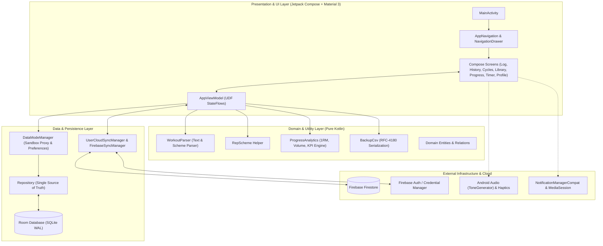
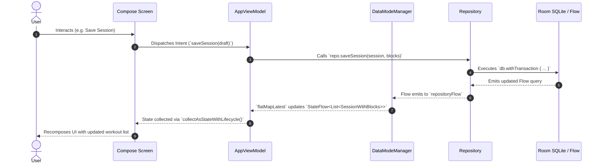

# Architecture & Engineering Standards (`.graph/architecture.md`)

**Repository**: `AntaresAndBharani/crosstrainingapp`  
**System**: CrossTraining Mobile Application (`com.fractanomics.crosstraining`)  
**Status**: Living Architecture Standard (Continuously Synchronized)  
**Target Runtime**: Android SDK 26–35 | Kotlin 2.0.21 (JVM 17) | Jetpack Compose (Material 3)  

---

## 🏛️ System Overview & Technology Stack

### System Overview
`CrossTraining` is an offline-first, local-persistence-driven Android application engineered to track CrossFit and functional fitness strength progression, daily training blocks (complexes, waves, EMOM, AMRAP, accessory work), personal rep-maxes (1RM/3RM/5RM), and monostructural cardio machines (Air Bike, Rower, SkiErg).

The application operates on an **Offline-First Reactive Architecture**:
1. **Primary Persistence**: All user routines, training cycles, historical sessions, and rep-maxes reside in local device storage powered by **Room (SQLite)** with transactional integrity.
2. **Multi-Database Sandbox**: A dedicated, isolated SQLite database file (`crosstraining-demo.db`) backs a zero-risk Demo Mode that never pollutes or cross-contaminates real athlete training data (`crosstraining.db`).
3. **Optional Cloud Synchronization**: An asynchronous, non-blocking cloud layer powered by **Firebase Firestore & Firebase Auth** provides user profile backup, community routine sharing, and cross-device sync without compromising offline availability.
4. **Foreground Engine**: A dedicated foreground service (`TimerService`) with `MediaSessionCompat` powers high-precision interval timers (EMOM, Tabata, Death By, AMRAP) with lock-screen notification controls and hardware haptics/audio cues.



### Technology Stack Matrix

| Layer / Concern | Technology | Version / Standard | Rationale |
|---|---|---|---|
| **Language & Platform** | Kotlin | `2.0.21` (JVM 17) | Modern type-safe language, Coroutines, Flow, Smart Casts, KSP support. |
| **Operating System Support** | Android SDK | `minSdk = 26`, `targetSdk = 35`, `compileSdk = 35` | Supports Android 8.0+ through Android 15 with modern runtime permissions. |
| **UI Toolkit** | Jetpack Compose + Material 3 | Compose BoM `2024.10.01`, M3 `1.3.1` | Declarative UI, dynamic color theming, edge-to-edge system bars, adaptive layouts. |
| **Navigation** | Navigation Compose | `2.8.4` | Type-safe declarative composable navigation with single-top backstack routing. |
| **State Management** | Kotlin Coroutines & Flow | `1.9.0` | `StateFlow` with lifecycle-aware collection (`collectAsStateWithLifecycle`). |
| **Local Persistence** | AndroidX Room (SQLite) | `2.6.1` via KSP | Typed DAOs, reactive query flows, foreign key cascading, and database migrations (v1–v5). |
| **Cloud Persistence** | Firebase Firestore KTX | BoM `33.9.0` | Cloud backup, multi-environment namespacing (`environments/{APP_ENV}/`), community sharing. |
| **Authentication** | Firebase Auth + Credential Manager | `play-services-auth:21.3.0`, `credentials:1.3.0` | Google Sign-In, Email/Password, Anonymous guest linking, and persistent sessions. |
| **Background Execution** | Android Foreground Service | AndroidX Media `1.7.0` | Continuous workout timer tracking with `MediaSessionCompat` lockscreen controls. |
| **Build & Tooling** | Android Gradle Plugin (AGP) | `8.7.2` | Gradle Kotlin DSL (`build.gradle.kts`), version catalog (`libs.versions.toml`). |
| **Testing Framework** | JUnit 4 + Coroutines Test | `junit:4.13.2`, `kotlinx-coroutines-test:1.9.0` | Deterministic unit tests for models, parsers, timers, and view model logic. |
| **E2E & UI Testing** | Maestro | Latest CLI | Declarative End-to-End visual workflow regression testing on Android emulators/devices. |

---

## 🧱 Layer Boundaries & Clean Architecture (Domain, Data, Presentation/UI separation of concerns)

The codebase strictly adheres to **Clean Architecture Principles** and **Unidirectional Data Flow (UDF)**. Dependencies point inward: the Presentation Layer depends on the Domain and Data Layers; the Domain Layer remains pure Kotlin, free from Android framework or database implementation details.

```mermaid
graph TD
    subgraph Layer 3: Presentation & UI
        UI_Screens["Jetpack Compose Screens (`ui/screens/*`)"]
        UI_Components["Reusable Composables (`ui/components/*`)"]
        UI_Nav["Navigation & Intent Router (`ui/navigation/*`)"]
        UI_VM["AppViewModel (`ui/AppViewModel.kt`)"]
        UI_Service["Foreground Timer Service (`ui/timer/TimerService.kt`)"]
    end

    subgraph Layer 2: Domain & Business Logic
        Domain_Parser["WorkoutParser (`util/WorkoutParser.kt`)"]
        Domain_RepScheme["RepScheme Engine (`util/RepScheme.kt`)"]
        Domain_Analytics["Progress & KPI Analytics (`ui/ProgressAnalytics.kt`)"]
        Domain_Backup["Backup Serialization (`data/Backup.kt`)"]
        Domain_Models["Core Domain Entities & Relations (`data/model/*`)"]
    end

    subgraph Layer 1: Data & Persistence
        Data_Manager["DataModeManager (Sandbox Proxy & Prefs)"]
        Data_Repo["Repository (Single Source of Truth)"]
        Data_Room["AppDatabase & DAOs (`data/dao/*`, `data/AppDatabase.kt`)"]
        Data_Firebase["UserCloudSyncManager & FirebaseSyncManager (`data/firebase/*`)"]
    end

    Layer 3 --> Layer 2
    Layer 3 --> Layer 1
    Layer 1 --> Layer 2
```

### Separation of Concerns

#### 1. Presentation Layer (`com.fractanomics.crosstraining.ui.*`)
- **Composables**: Pure declarative functions describing UI elements. Composables remain stateless whenever possible, accepting state and emitting lambda events (e.g. `onSaveSession`, `onToggleRole`).
- **ViewModel (`AppViewModel`)**: Owns UI state transformation. Subscribes to cold flows from the `Repository` and transforms them into lifecycle-aware `StateFlow<T>` streams using `stateIn(viewModelScope, SharingStarted.WhileSubscribed(5_000), initial)`. Dispatches business actions on `Dispatchers.IO` or `viewModelScope`.
- **Navigation (`AppNavigation`, `NavigationIntentHandler`)**: Encapsulates single-top navigation routing, dynamic Bottom Navigation bar switching (Athlete vs. Coach role), modal drawer navigation, and external intent interception (e.g., notification tap routing to `/timer`).
- **Foreground Timer Subsystem (`ui/timer/*`)**: Coordinates high-accuracy countdowns, lock-screen media notifications (`MediaStyle`), audio tone generation, and vibration feedback, isolated behind `TimerEngine`, `TimerTeardownController`, and `TimerNotificationActionDispatcher`.

#### 2. Domain & Business Logic Layer (`com.fractanomics.crosstraining.util.*`, `data/model/*`, `ui/ProgressAnalytics.kt`)
- **Workout Parsing (`WorkoutParser`)**: Pure deterministic regex tokenizer capable of translating unstructured text (e.g. `"Snatch 3-2-1-3-2-1 @ 60-80kg E2MOM"`) into structured workout blocks, set counts, target reps, and interpolated weight progressions.
- **Analytics & Progression (`ProgressAnalytics`)**: Pure analytical aggregators calculating working-set volume (tonnage: $\sum (\text{weight} \times \text{reps})$), personal record (PR) rep-max bests, and daily training performance summaries.
- **Data Serialization (`BackupCsv`)**: RFC-4180 compliant CSV serializer and tokenizer ensuring complete relational database portability with foreign key preservation.
- **Entities & Relations**: Type-safe relational mappings between `Cycle`, `Session`, `SessionBlock`, `BlockSet`, `Exercise`, `Routine`, `RepMax`, and `CycleGoal`.

#### 3. Data & Persistence Layer (`com.fractanomics.crosstraining.data.*`)
- **Repository (`Repository`)**: Single Source of Truth for application data. Mediates between Room DAOs and consumers, orchestrating multi-entity database transactions (`db.withTransaction { ... }`) for atomic session insertions and cascade deletions.
- **Data Mode Manager (`DataModeManager`)**: Context-aware proxy managing runtime database switching between the real user database (`crosstraining.db`) and the pre-populated demo sandbox (`crosstraining-demo.db`), alongside persistent SharedPreferences (theme modes, user role, auth tokens).
- **Room Persistence (`AppDatabase`, `data/dao/*`)**: Concrete SQLite ORM mapping with explicit table indices, foreign key cascades, type converters (`Converters.kt`), and automated schema migration paths (`MIGRATION_1_2` through `MIGRATION_4_5`).
- **Cloud Synchronization (`data/firebase/*`)**: Manages Google Credential authentication, email authentication, and remote synchronization of exercises, routines, sessions, and cycle goals scoped to the active deployment environment (`currentEnv`).

---

## 📁 Directory & Package Structure Guidelines

```text
app/src/main/java/com/fractanomics/crosstraining/
├── CrossTrainingApp.kt               # Application class (Composition Root & Service Provider)
├── MainActivity.kt                  # Single-Activity host, Edge-to-Edge & Intent interceptor
│
├── data/                            # Persistence & Data Access Layer
│   ├── AppDatabase.kt               # Room Database definition, migrations (v1-v5), instance factory
│   ├── Backup.kt                    # RFC-4180 CSV Export / Import serialization engine
│   ├── Converters.kt                # Room TypeConverters (LocalDate, Enums)
│   ├── DataModeManager.kt           # Real vs Demo database proxy & SharedPreferences manager
│   ├── DemoData.kt                  # Seed dataset generator for Demo Sandbox
│   ├── Repository.kt                # Primary Data Repository (SSOT, transactional operations)
│   ├── SeedData.kt                  # Factory initial starter data for exercises and routines
│   │
│   ├── dao/                         # Room Data Access Objects
│   │   ├── BlockDao.kt              # Session block & set queries
│   │   ├── CycleDao.kt              # Training cycle operations & active cycle toggle
│   │   ├── CycleGoalDao.kt          # Movement target goals per cycle
│   │   ├── ExerciseDao.kt           # Movement library queries & search
│   │   ├── RepMaxDao.kt             # PR / Rep-max tracking records
│   │   └── SessionDao.kt            # Training session records & historical queries
│   │
│   ├── firebase/                    # Cloud Synchronization & Authentication
│   │   ├── FirebaseSyncManager.kt   # Community routine publishing & share-code retrieval
│   │   └── UserCloudSyncManager.kt  # User profile sync, cloud backup & environment isolation
│   │
│   └── model/                       # Data entities, enums & relational models
│       ├── BlockSet.kt              # Individual exercise set entity
│       ├── Cycle.kt                 # Training cycle entity
│       ├── CycleGoal.kt             # Target rep-max goal entity for a cycle
│       ├── Enums.kt                 # ExerciseCategory, MetricType, BlockKind
│       ├── Exercise.kt              # Movement library entity
│       ├── Relations.kt             # 1-to-N Room Relations (SessionWithBlocks, CycleWithGoals)
│       ├── RepMax.kt                # Personal record entity
│       ├── Routine.kt               # Reusable routine template entity
│       ├── RoutineBlock.kt          # Individual block within a routine
│       ├── Session.kt               # Training day session entity
│       ├── SessionBlock.kt          # Executed block within a session
│       └── UserRole.kt              # Athlete vs Coach role taxonomy
│
├── ui/                              # Presentation & UI Layer
│   ├── AppViewModel.kt              # Central ViewModel exposing reactive StateFlows
│   ├── Format.kt                    # Number, weight, and date UI formatters
│   ├── ProgressAnalytics.kt         # Volume, 1RM, and progression calculation models
│   ├── SessionDraft.kt              # UI-state draft models for session and block creation
│   │
│   ├── components/                  # Shared Jetpack Compose UI Widgets
│   │   ├── CommonUi.kt              # Buttons, chips, dialogs, and text headers
│   │   ├── DateField.kt             # DatePicker integration field
│   │   ├── Dropdown.kt              # Filter and selection dropdowns
│   │   ├── LineChart.kt             # Custom Canvas-drawn progression line charts
│   │   └── QuickAddWorkoutDialog.kt # Natural language workout parsing & insertion dialog
│   │
│   ├── navigation/                  # Navigation & Routing
│   │   ├── AppNavigation.kt         # NavHost, Scaffold, BottomNavigationBar, Drawer
│   │   └── NavigationIntentHandler.kt # Deep link and notification intent dispatcher
│   │
│   ├── screens/                     # Screen-level Composables
│   │   ├── CyclesScreen.kt          # Cycle management and goal planning screen
│   │   ├── HistoryScreen.kt         # Past workout session log & filtering
│   │   ├── LibraryScreen.kt         # Movement library, routine builder & CSV backup
│   │   ├── LoginWelcomeScreen.kt    # Auth entry point (Google, Email, Guest demo)
│   │   ├── LogSessionScreen.kt      # Active workout logging screen
│   │   ├── ProfileScreen.kt         # User profile, role switcher, theme & cloud sync
│   │   ├── ProgressScreen.kt        # Rep-max PRs and volume progression charts
│   │   ├── SessionEditor.kt         # Multi-block session editor / cloner
│   │   └── TimerScreen.kt           # Interactive multi-mode workout timer
│   │
│   ├── theme/                       # Design System & Theming
│   │   ├── Color.kt                 # Material 3 color palettes (Light, Dark, High-Contrast)
│   │   ├── Theme.kt                 # CrossTrainingTheme Composable wrapper
│   │   └── Type.kt                  # Typography definitions
│   │
│   └── timer/                       # Foreground Timer Subsystem
│       ├── TimerEngine.kt           # Ticker loop, state machine, audio/haptic cues
│       ├── TimerEngineProvider.kt   # Singleton engine provider across app/service
│       ├── TimerNotificationActionDispatcher.kt # Notification action intent router
│       ├── TimerNotificationFormatter.kt # Notification text formatters
│       ├── TimerNotificationSpec.kt # MediaStyle notification specifications
│       ├── TimerService.kt          # Android Foreground Service lifecycle
│       ├── TimerTeardownController.kt # Deterministic service teardown & notification cleanup
│       └── WorkoutTimer.kt          # Timer modes, configs, and snapshot data classes
│
└── util/                            # Pure Domain Utilities
    ├── RepScheme.kt                 # Repetition scheme parser and formatter
    └── WorkoutParser.kt             # Freeform text & structured workout regex parser
```

### Module Responsibilities & Conventions
- **Single Responsibility**: Each package has a clear boundary. UI screens must not interact with DAOs directly; data models must not contain Android View or Compose dependencies.
- **State Hoisting**: Composables in `ui/screens` must hoist state up to `AppViewModel` or accept state values and emit event callbacks.
- **Pure Utility Extraction**: Business rules such as CSV encoding, workout text parsing, and progression math reside in `util/` or pure Kotlin data models to ensure 100% unit testability without Robolectric or emulator overhead.

---

## 🎨 Design Patterns, State Management & Dependency Injection

### 1. Unidirectional Data Flow (UDF) & Reactive StateFlows
The application follows standard Android UDF architecture. State flows strictly downwards; user events flow strictly upwards.



### 2. Multi-Database Sandbox & Proxy Pattern (`DataModeManager`)
To provide a friction-free onboarding experience without risking user data corruption, `DataModeManager` acts as a dynamic proxy between two distinct SQLite database files:
- **`crosstraining.db`**: Primary local store containing real athlete data.
- **`crosstraining-demo.db`**: Isolated sandbox pre-populated with realistic multi-week training cycles, sessions, routines, and PR charts.

```kotlin
// AppViewModel dynamically switches the active reactive stream when demo mode toggles
val sessions: StateFlow<List<SessionWithBlocks>> =
    data.repositoryFlow.flatMapLatest { it.allSessions }.stateInDefault(emptyList())
```
When a user toggles Demo Mode, `data.repositoryFlow` emits the appropriate repository instance, instantly rebinding every UI flow across the entire application without requiring an application restart.

### 3. Decoupled Service Architecture & Graceful Teardown (`TimerService`)
Background execution for workout timers decouples audio/ticker math from Android Service lifecycle management:
1. **`TimerEngine`**: A pure timing engine running a coroutine ticker loop (`delay(1000)`), updating immutable `TimerSnapshot` emissions.
2. **`TimerService`**: Android Foreground Service hosting an active `MediaSessionCompat` and publishing `NotificationCompat.MediaStyle` notifications.
3. **`TimerTeardownController`**: Encapsulates deterministic shutdown logic. When the timer finishes, is stopped, or is reset, the controller cancels notifications, releases media sessions, detaches foreground state (`ServiceCompat.stopForeground`), and terminates the service (`stopSelf()`) without memory leaks or phantom notifications.

### 4. Dependency Injection via Composition Root
The project uses a lightweight, deterministic **Composition Root** pattern:
- `CrossTrainingApp` serves as the central application container, lazily instantiating `DataModeManager` and `TimerEngineProvider`.
- `AppViewModel.factory(dataModes)` supplies dependencies via `ViewModelProvider.Factory`, ensuring ViewModels survive configuration changes without singletons or hidden global state.

---

## 🚫 Architectural Constraints & Anti-Patterns

### Strict Architectural Constraints

1. **No UI or Android Context in Domain / Model Layer**:
   - `data/model/*`, `util/*`, and `ui/ProgressAnalytics.kt` must remain pure Kotlin.
   - Never import `android.content.Context`, `android.view.View`, or Compose packages into domain utilities.

2. **No Direct DAO Access from UI / ViewModels**:
   - ViewModels and Composables must never reference `AppDatabase` or DAOs directly. All reads and writes must pass through `Repository`.

3. **Atomic Multi-Table Mutations via `withTransaction`**:
   - Any write involving related entities (e.g. saving a `Session` with its `SessionBlock`s, `BlockSet`s, and `RepMax`es; or saving a `Cycle` with `CycleGoal`s) MUST be wrapped in `db.withTransaction { ... }` to prevent partial write anomalies.

4. **Zero Data Leakage Between Real & Demo Sandboxes**:
   - Demo mode operations must execute exclusively against `crosstraining-demo.db`. Never route demo queries or seed executions to `crosstraining.db`.

5. **Lifecycle-Aware Flow Collection in Compose**:
   - UI Composables must always collect ViewModel state streams using `collectAsStateWithLifecycle()` (from `androidx.lifecycle.compose`) to prevent background processing when the app is in the background.

6. **Environment-Isolated Cloud Namespacing**:
   - All Firestore documents must be segregated under `environments/{APP_ENV}/...` (where `APP_ENV` is `"production"` or `"snapshot"`), preventing development or snapshot builds from overwriting production user documents.

7. **Zero Machine-Specific Build Paths**:
   - Never commit local JVM or SDK paths (e.g. `org.gradle.java.home`) to repository `gradle.properties`. Machine configurations belong strictly in user-level `~/.gradle/gradle.properties`.

### Anti-Patterns to Avoid

| Anti-Pattern | Violation | Required Architecture Solution |
|---|---|---|
| **Direct DB Writes in UI** | Launching database operations directly inside a `@Composable` function. | Dispatch intent to `AppViewModel`, execute asynchronously via `viewModelScope` on `Repository`. |
| **Context Leaks in ViewModel** | Storing an Activity or View `Context` reference in `AppViewModel`. | Use `ApplicationContext` strictly inside `DataModeManager` or inject specific utility providers. |
| **Unbounded Foreground Service** | Leaving `TimerService` active in foreground after timer stops or completes. | Trigger `TimerTeardownController.performGracefulTeardown()` to release media session and call `stopSelf()`. |
| **Blocking the Main Thread** | Performing file I/O or JSON/CSV parsing on `Dispatchers.Main`. | Dispatch file operations to `Dispatchers.IO` with `withContext(Dispatchers.IO)`. |
| **Un-indexed SQLite Foreign Keys** | Creating foreign key relations without backing indices in Room entities. | Add explicit `@Index` annotations on foreign key columns (e.g. `sessionId`, `routineId`, `cycleId`). |
| **Mutable State Exposure** | Exposing `MutableStateFlow` or `MutableList` from `AppViewModel`. | Expose immutable `StateFlow<T>` or `List<T>` to preserve encapsulation. |

---

## 📋 Definition of Done (DoD) for Architecture & Code Updates

Before any feature, refactoring, or architectural change is deemed complete:
1. **Local Test Verification**:
   - All unit tests must pass cleanly: `.\gradlew.bat testDebugUnitTest --no-daemon`.
   - Script and regression test suites must pass: `.\scripts\tests\Invoke-ScriptTests.ps1`.
2. **Build & Lint Cleanliness**:
   - Lint check executes without fatal errors: `.\gradlew.bat lintDebug --no-daemon`.
   - Debug and Snapshot APK builds compile successfully: `.\gradlew.bat assembleSnapshot -PsnapshotLabel=localtest --no-daemon`.
3. **E2E Visual Parity**:
   - If UI changes or new screens are introduced, run `.\scripts\run-e2e-tests.ps1 -CaptureArtifacts -Version "latest" -PushArtifacts` to capture and commit updated screenshots to `docs/screenshots/`.
4. **Living Documentation Sync**:
   - Architectural updates must be immediately reflected in `.graph/architecture.md` and `README.md`.
5. **Changelog Maintenance**:
   - An entry describing changes must be recorded in `CHANGELOG.md` under `## [Unreleased]`.
6. **Remote CI 100% Green**:
   - Push branch and open a PR. Confirm that all GitHub Actions workflows (`build.yml`, snapshot pre-release) finish **100% Green / Passing**.
