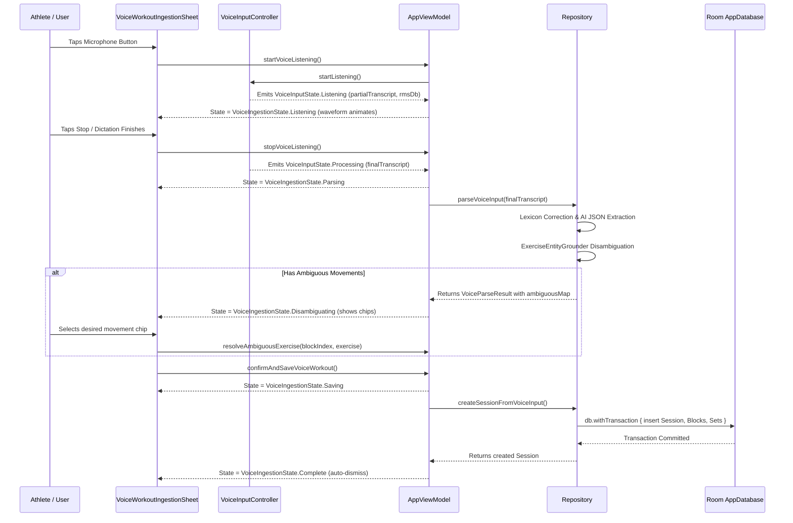
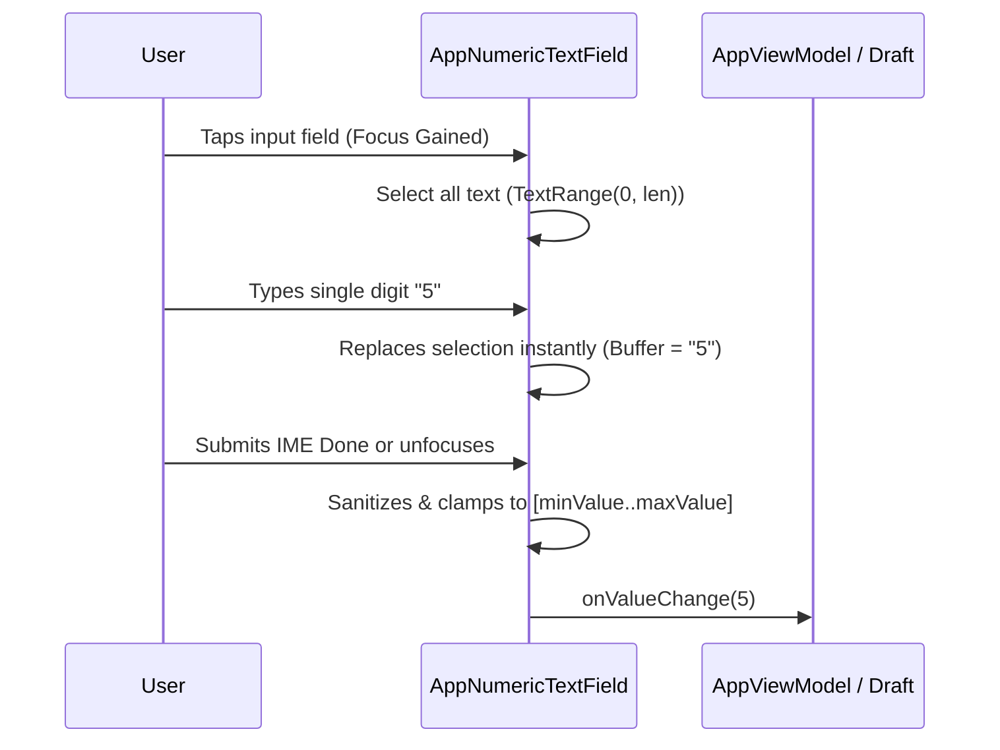

# CrossTraining App — System Architecture & Standards

## System Overview & Technology Stack

**CrossTraining** (`com.fractanomics.crosstraining`) is an offline-first Android application engineered for CrossFit athletes, strength trainees, and strength & conditioning coaches. The platform enables comprehensive tracking of strength progressions, complex barbell routines, periodized training cycles, monostructural conditioning metrics, body weight trend analytics, audio/haptic interval timers, natural language voice workout dictation, deterministic markdown document ingestion, dual-sandbox data isolation, and multi-tenant cloud synchronization.

```mermaid
graph TD
    subgraph Presentation ["Presentation Layer (Jetpack Compose / Material 3)"]
        UI["Compose Screens & Modals (ui.screens, ui.voice, ui.components, ui.screens.weight)"]
        VM["AppViewModel (UDF State Holder & Flow Combinator)"]
        Nav["Navigation Compose & NavigationIntentHandler"]
        InSessionTimer["In-Session Timers (InSessionTimerBar, InSessionTimerSheet, SubBlockInlineTimer)"]
    end

    subgraph IngestionAI ["Voice, Text & AI Ingestion Subsystem"]
        VoiceCtrl["VoiceInputController (SpeechRecognizer & Noise Suppression)"]
        Lexicon["FitnessSpeechLexicon (Phonetic & STT Normalization)"]
        AiCore["AiCoreManager (Gemini Nano / Heuristic Fallback)"]
        Grounder["ExerciseEntityGrounder (Fuzzy Matching & Movement Disambiguation)"]
        Resolver["WorkoutEntityResolver (Composite Isolation & Category Inference)"]
        DocParser["WorkoutDocumentParser (Zero-Latency Deterministic Parsing & Sub-Block Attribution)"]
        TimerParser["WorkoutTimerConfigParser (Canonical Format Token Extractor)"]
    end

    subgraph AnalyticsSubsystem ["Domain Analytics Subsystem"]
        WeightAna["WeightAnalytics (Historical Lookback SMA-7, Paired Decimation & Bounds)"]
        ProgAna["ProgressAnalytics (Volume & PR Trend Calculations)"]
    end

    subgraph DataPersistence ["Data Layer & Local Persistence"]
        DMM["DataModeManager (Dual-Sandbox Routing: Live vs Demo)"]
        Repo["Repository (Single Source of Truth & Atomic Persistence)"]
        RoomDB[("Room AppDatabase (SQLite, Migrations v1-v8, Schemas Export v5-v8)")]
        BackupEng["BackupCsv (v5 RFC-4180 Relational Engine with Sub-Block Parity)"]
    end

    subgraph CloudIdentity ["Cloud Sync & Identity Subsystem"]
        CredMgr["Credential Manager & Google ID (androidx.credentials)"]
        CloudSync["UserCloudSyncManager (Token-Bound Sync, supervisorScope & Tombstones)"]
        CommunitySync["FirebaseSyncManager (Share Codes & Community WODs)"]
        Firestore[("Cloud Firestore (Multi-Tenant Environments)")]
        FirebaseAuth[("Firebase Auth (UID Token Verification)")]
    end

    subgraph PeripheralsServices ["Foreground Services & Hardware Subsystems"]
        TimerSub["TimerEngine (Tick Loop, Mode State Machine & previousRound Rewind)"]
        TimerProv["TimerEngineProvider (Application-Scoped Composition Root)"]
        TimerSvc["TimerService (MediaStyle Notification, Audio ToneGenerator & Haptics)"]
    end

    UI -->|User Intents & Input Events| VM
    VM -->|Collects StateFlow via collectAsStateWithLifecycle| UI
    VM -->|Dispatches Business Actions| Repo
    VM -->|Toggles Active Sandbox Mode| DMM
    DMM -->|Swaps Active Database Context| Repo
    Repo -->|Atomic SQL Transactions & Queries| RoomDB
    
    UI -->|Triggers Voice Ingestion Sheet| VoiceCtrl
    VoiceCtrl -->|Audio RMS dB & Partial Transcripts| VM
    VoiceCtrl -->|Final Transcript| Repo
    Repo -->|1. Phonetic Correction| Lexicon
    Repo -->|2. Structured Extraction| AiCore
    Repo -->|3. Movement Disambiguation| Grounder
    Grounder -->|Resolves Catalog IDs| RoomDB
    Repo -->|4. Atomic Commit (Session, Blocks, Sets)| RoomDB

    UI -->|Pastes Raw Workout Text| DocParser
    DocParser -->|Structured Document Blocks & Sub-Blocks| Resolver
    Resolver -->|Grounds Movements & Isolates Complexes| RoomDB
    Resolver -->|Proposes Block Resolutions & Missing Moves| VM
    VM -->|Confirms Ingestion with Mutex Guard| Repo

    UI -->|Taps Sub-Block / Movement Timer Launcher| TimerParser
    TimerParser -->|Parses Modality & Context Tokens| TimerSub
    InSessionTimer -->|Direct 1Hz Leaf Observation & Non-Focus Controls| TimerSub
    TimerSub <-->|Foreground Service & Media Notifications| TimerSvc

    VM -->|Applies Timeframe & Historical Lookback SMA-7 Pipeline| WeightAna
    WeightAna -->|Emits Decimated Index-Parallel Points| UI

    VM -->|Triggers Background Sync| CloudSync
    CredMgr -->|Authenticates Credentials| FirebaseAuth
    CloudSync -->|Token Verification & Cold-Start Await| FirebaseAuth
    CloudSync -->|Fault-Isolated Concurrent Upload supervisorScope| Firestore
    CommunitySync <-->|Public Routine Exchange| Firestore

    UI <-->|Observes & Controls Timer| TimerSub
    TimerSub <-->|Singleton Injection| TimerProv
    Nav -.->|Routes Notification Deep Links| UI
```

### Technology Stack & Framework Specifications

| Tier / Subsystem | Technology | Specification / Version | Architectural Role |
|---|---|---|---|
| **Language & Runtime** | Kotlin | `2.0.21` / JVM 17 (`compileOptions`, `kotlinOptions`) | Strongly-typed functional & object-oriented application core |
| **Android SDK Target** | Android SDK | `minSdk 26`, `targetSdk 35`, `compileSdk 35` | Android 15 platform compliance with Android 8.0+ backwards compatibility |
| **UI Toolkit** | Jetpack Compose | Compose BOM `2024.10.01`, Material 3 | Declarative, reactive, component-driven user interface |
| **Navigation** | Navigation Compose | `2.8.4` (`androidx.navigation.compose`) | Single-Activity declarative navigation host, canonical drawer routing, deep-linking |
| **Persistence** | AndroidX Room | `2.6.1` with KSP `2.0.21-1.0.28`, Schema v8 | Local relational SQLite database with typed DAOs, schema export, and migrations (v1–v8) |
| **Asynchronous & Concurrency** | Kotlin Coroutines & Flow | `1.9.0` (`StateFlow`, `SharedFlow`, `supervisorScope`) | Structured concurrency, reactive data streaming, non-blocking I/O |
| **Lifecycle Integration** | AndroidX Lifecycle | `2.8.7` (`lifecycle-runtime-compose`, `viewmodel-compose`) | Lifecycle-aware UI state collection (`collectAsStateWithLifecycle`) |
| **Identity & Authentication** | Credential Manager & Google ID | `androidx.credentials:1.3.0`, `googleid:1.1.1`, Play Services Auth `21.3.0` | Modern biometric, passkey, and Google ID token authentication flows |
| **Cloud Synchronization** | Firebase SDKs | Firebase BoM `33.9.0` (Firestore, Auth, Analytics) | Multi-tenant cloud synchronization, user authentication, and workout sharing |
| **On-Device AI Inference** | Android AICore / Gemini Nano | `GeminiNanoClient` contract with heuristic parser fallback | On-device structured natural language workout block and set extraction |
| **Speech Recognition** | Android SpeechRecognizer | `android.speech.SpeechRecognizer` with noise suppression flags | On-device voice dictation, real-time partial transcripts, and RMS dB streaming |
| **Media & Peripherals** | AndroidX Media & Audio | `androidx.media:1.7.0`, `ToneGenerator`, `VibratorManager` | Foreground MediaStyle notifications, audio interval cues, and haptics |
| **Build & Tooling** | Gradle Kotlin DSL | AGP `8.7.2`, Gradle Wrapper | Automated reproducible build pipelines, signing, and asset packaging |

### Multi-Environment Packaging & Build Variants

The build system defines three distinct build types:
- **`debug`**: Local development build configured with `APP_ENV="snapshot"` and signed with the standard debug keystore.
- **`snapshot`**: Pre-release CI verification build inheriting from `debug` configuration with matching fallbacks, compiled for automated E2E and device testing.
- **`release`**: Production-optimized build configured with `APP_ENV="production"`, integrating ProGuard/R8 optimizations (`proguard-rules.pro`), and signed using secure environment keystore credentials (`RELEASE_STORE_FILE`, `RELEASE_KEY_ALIAS`) with graceful debug keystore fallback.

---

## Layer Boundaries & Clean Architecture (Domain, Data, Presentation/UI separation of concerns)

The codebase strictly adheres to **Clean Architecture** principles and **Unidirectional Data Flow (UDF)**. Dependencies strictly point inward toward domain models and business logic.


```mermaid
graph RL
    subgraph Presentation ["Presentation Layer (ui)"]
        UI_Screens["Compose Screens (ui.screens, ui.screens.weight)"]
        UI_Voice["Voice Ingestion UI (ui.voice)"]
        UI_Components["Design System & In-Session Timers (ui.components)"]
        UI_VM["AppViewModel (UDF State Holder & Flow Combinator)"]
        UI_Nav["Navigation & Intent Handling (ui.navigation)"]
        UI_Timer["Timer Engine, Parsers & Service (ui.timer)"]
    end

    subgraph Data ["Data Layer (data)"]
        D_Repo["Repository (Single Source of Truth)"]
        D_Mode["DataModeManager (Sandbox Routing: Live vs Demo)"]
        D_AI["On-Device AI Engine (data.ai: AiCoreManager, Grounder, Resolver)"]
        D_Voice["Speech Ingestion (data.voice: VoiceInputController)"]
        D_DAO["Room DAOs (data.dao: Block, Cycle, Goal, Exercise, RepMax, Routine, Session, Weight)"]
        D_DB["AppDatabase (SQLite & Migrations v1-v8, Schemas Export v5-v8)"]
        D_Cloud["UserCloudSyncManager & FirebaseSyncManager (data.firebase)"]
        D_Backup["Backup & CSV Migration Engine (data.BackupCsv v5)"]
    end

    subgraph Domain ["Domain & Utility Layer (util, data.model & data.analytics)"]
        DOM_Models["Entities & Relations (Cycle, Session, Routine, RepMax, WeightEntry, etc.)"]
        DOM_Enums["Domain Enums (BlockKind, MetricType, UserRole, TimerMode, Timeframe, etc.)"]
        DOM_Voice["Voice State Machine (VoiceIngestionState, ParsedBlock, ParsedBlockSet)"]
        DOM_Lexicon["Domain Lexicon (FitnessSpeechLexicon)"]
        DOM_Analytics["Domain Analytics (WeightAnalytics, ProgressAnalytics)"]
        DOM_Utils["Pure Algorithms (WorkoutDocumentParser, WorkoutParser, RepScheme)"]
        DOM_Timer["Canonical Timer Tokens & Parsers (WorkoutTimerConfigParser)"]
    end

    Presentation --> Data
    Presentation --> Domain
    Data --> Domain
```

### 1. Domain & Utility Layer (`com.fractanomics.crosstraining.util`, `data.model` & `data.analytics`)
- **Responsibilities:**
  - Contains core business entities (`Cycle`, `Session`, `Routine`, `Exercise`, `RepMax`, `BlockSet`, `RoutineBlock`, `SessionBlock`, `CycleGoal`, `WeightEntry`), domain relations (`BlockWithSets`, `SessionWithBlocks`, `RoutineWithBlocks`, `CycleWithGoals`), and domain enums (`BlockKind` with `shortLabel`, `MetricType`, `ExerciseCategory`, `UserRole`, `TimerMode`, `TimerPhase`, `Timeframe`).
  - Encapsulates hierarchical workout metadata:
    - `RoutineBlock` and `SessionBlock` incorporate `section: String` (Macro-Block Section e.g. "Warm-up", "Part A - Strength", "Part B - Metcon") and `subBlock: String` (Sub-Block Container e.g. "E3MOM Trisets", "Superset A", "EMOM 10", "Complex").
  - Encapsulates domain contracts for AI and document parsing (`ParsedBlock`, `ParsedBlockSet`, `WorkoutParseResult`, `GroundingMatch`, `ParsedWorkoutDocument`, `ParsedDocumentBlock`, `ParsedDocumentSet`, `WorkoutEntityResolutionResult`, `ResolvedBlockEntity`).
  - Houses the formal 7-stage voice ingestion lifecycle state machine (`VoiceIngestionState`).
  - Encapsulates pure domain algorithms:
    - `WorkoutDocumentParser`: Deterministic, zero-latency (< 15ms) document parser for unformatted workout notes, applying digit-bounded lookaround regex `(?<=\d),(?=\d)` for European decimal comma normalization (`internal val DECIMAL_COMMA_REGEX`), inline colon non-label guards, context-aware triset boundary termination, blank-line lookahead, shorthand set grammar (`0(4)`, `60(fail)`, `not_done`), and automated sub-block derivation.
    - `WorkoutTimerConfigParser`: Pure Kotlin canonical timer configuration parser extracting modalities (`E{X}MOM`, `EMOM`, `AMRAP`, `TABATA`, `FOR TIME`/`FT`, `REST`), sharing `WorkoutDocumentParser`'s canonical format tokens (`internal val FORMAT_REGEX`) to guarantee zero divergence between text ingestion and timer execution.
    - `WorkoutParser`: Regex-driven free-text workout syntax parsing, rep-scheme extraction, and movement extraction.
    - `RepScheme`: Wave-loading validation, rep-count decomposition, and string formatting.
    - `FitnessSpeechLexicon`: Pure Kotlin phonetic normalization engine mapping fitness acronyms, Olympic lifting terms, and common speech-to-text artifacts without platform dependencies, engineered with bounded look-behinds to prevent Android ICU regex engine crashes.
    - `WeightAnalytics`: Physiological range validation ([20.0 kg, 350.0 kg], [44.1 lbs, 771.6 lbs]), timeframe filtering (`7D`, `30D`, `90D`, `1Y`, `ALL`), **Historical Lookback Bounded Backward Scan Engine** over full active history (`activeSorted`) for 7-day Simple Moving Average (SMA-7) across the closed calendar window `[t-6, t]` requiring `N >= 3` entries without leading-edge gaps, and paired decimation down to `<= 120` points preserving index parallelism across raw and trend lines.
- **Architectural Invariants:**
  - **Zero Platform Dependencies:** Must not import Android framework classes (`android.*`, `Context`, `View`, `Bundle`, Compose UI tokens, or Room annotations beyond entity definitions).
  - **Deterministic & Pure:** All functions must be deterministic, free of side-effects, and 100% unit-testable without Android mocks, instrumentation, or Robolectric runners.

### 2. Data Layer (`com.fractanomics.crosstraining.data`)
- **Responsibilities:**
  - **Room Database & DAOs (`data.dao`):** Provides strongly-typed SQL mapping, foreign key constraints, cascading deletes, indexes, and reactive queries via Kotlin `Flow`. Features 10 entities, 8 DAOs (`BlockDao`, `CycleDao`, `CycleGoalDao`, `ExerciseDao`, `RepMaxDao`, `RoutineDao`, `SessionDao`, `WeightDao`), and schema migrations (v1 through v8) with automated schema export.
    - `MIGRATION_7_8`: Pure DDL migration adding `subBlock TEXT NOT NULL DEFAULT ''` to `session_blocks` and `routine_blocks`, registered identically in both production `AppDatabase.build()` and demo `AppDatabase.demo()`.
  - **Single Source of Truth (`Repository`):** Coordinates multi-entity transactional persistence using `db.withTransaction { ... }`. Encapsulates write-time business logic such as auto-creating exercises (`getOrCreateExercise`), synchronizing routine blocks, discovering new rep-maxes, startup default cycle provisioning, routine deduplication, async legacy sub-block backfill, and natural primary key weight snapshot persistence.
  - **Dual-Sandbox Routing (`DataModeManager`):** Manages session-scoped in-memory switching between the live database (`crosstraining.db`) and the disposable sample database (`crosstraining-demo.db`), guaranteeing that demo sessions cannot corrupt athlete history. Provides `realRepository` for strictly isolated background sync operations.
  - **On-Device AI, Document Grounding & Speech Ingestion (`data.ai`, `data.voice`):**
    - `VoiceInputController`: Wraps `SpeechRecognizer` with acoustic noise suppression intent flags, manages audio focus, streams real-time RMS dB levels and partial transcripts, and handles standardized error translation (`VoiceInputError`).
    - `AiCoreManager`: Decoupled via `GeminiNanoClient` interface. Orchestrates prompt construction commanding strict JSON schemas, parses resilient JSON, and seamlessly falls back to heuristic rule-based parsing when on-device AI is unavailable.
    - `ExerciseEntityGrounder`: Matches recognized movement text against Room `ExerciseDao` movements using exact alias maps, token overlap, and Levenshtein distance metrics (confidence threshold 0.0–1.0) to prompt disambiguation for ambiguous queries.
    - `WorkoutEntityResolver`: Performs in-transaction entity grounding, category and metric type inference (Machine -> CALORIES/DISTANCE, Gymnastics -> REPS/WEIGHT, Barbell -> WEIGHT), and barbell complex composite isolation.
  - **Cloud Synchronization & Identity (`data.firebase`):**
    - `UserCloudSyncManager`: Manages token-bound identity verification, cold-start auth resolution (`awaitAuthState`), fault-isolated concurrent uploads across 6 collections (`exercises`, `routines`, `sessions`, `cycle_goals`, `rep_maxes`, `weight_entries`) using `supervisorScope`, per-document empty overwrite protection (`uploadCollectionWithGuard`), dual-read cloud migrations, pre-flight 90-day tombstone purge, and tombstone-aware synchronization (`WeightEntry.deletedAtMillis`).
    - `FirebaseSyncManager`: Global community workout publishing and retrieval via alphanumeric 6-character share codes.
    - `CloudSyncErrorMapper`: Translates Firestore network timeouts, unauthenticated states, and permission denials into user-friendly UI feedback with 5-second cooldown debounce state.
  - **Backup & Migration Engine (`BackupCsv`, `AppDatabase.MIGRATION_*`):** Manages RFC-4180 relational CSV serialization/deserialization (`#crosstraining-backup-v5` supporting 9 tables/sections including `subBlock` in `#routineBlocks` [index 11] and `#blocks` [index 15]) and SQLite schema migrations (v1 through v8).
- **Architectural Invariants:**
  - DAOs must remain package-private or accessible exclusively through `Repository`.
  - All database writes, file I/O, network operations, and AI inference must execute on background coroutine dispatchers (`Dispatchers.IO`).
  - Empty local datasets must never overwrite populated remote cloud collections without explicit guard verification.
  - Deletions synced to cloud Firestore must carry durable tombstones (`deletedAtMillis`) to prevent deleted records from resurrecting on sibling devices.

### 3. Presentation / UI Layer (`com.fractanomics.crosstraining.ui`)
- **Responsibilities:**
  - **State Orchestration (`AppViewModel`):** Central state holder for the UI. Binds reactive streams from `DataModeManager.repositoryFlow`, exposes lifecycle-safe `StateFlow<T>`, and receives user intents to trigger coroutine executions on `viewModelScope`. Exposes `progressMode`, `voiceIngestionState`, `voiceWorkoutUiState`, and workout journey assistant draft state with mutex persistence guards.
  - **Single-Activity Host & Navigation (`MainActivity`, `ui.navigation`):** Single-Activity architecture with edge-to-edge system bar configuration. Defines top-level navigation routes (`BottomDestination`, `DrawerItem`), dynamic bottom bars based on user role (`ATHLETE` vs `COACH`), mutually exclusive canonical drawer routing between `"progress"` (with `ProgressMode.BODY_WEIGHT`) and standard analytics, and routes external notifications via `NavigationIntentHandler`.
  - **Stateful Screens & Stateless Content (`ui.screens`):** Implements strict separation between stateful container composables (which inject the ViewModel) and stateless presentation composables (which receive pure data classes and emit lambdas).
  - **Hierarchical Workout UI & Parity:**
    - `SessionEditor.kt`: Groups workout blocks into Macro-Block sections and Sub-Block groups via `groupEditorBlocks()`, rendering nested `OutlinedCard` containers with sub-block headers, clickable format/round badges, and inline movement editing.
    - `HistoryScreen.kt` & `LibraryScreen.kt`: Sub-Block grouping parity via `groupHistoryBlocks()` and `groupRoutineBlocks()` partitioning contiguous blocks by section and sub-block with asymmetric round reconciliation (`maxOf(sets.size)` in history, `maxOf(setsCount)` in routines).
  - **In-Session Timing Subsystem (`ui.components`, `ui.timer`):**
    - `InSessionTimerBar`: Compact docked bottom bar rendered above bottom navigation in `SessionEditor`, isolating 1Hz countdown ticks to avoid parent form recomposition, with non-focus-stealing controls (`focusProperties { canFocus = false }`) preserving virtual keyboard focus.
    - `InSessionTimerSheet`: In-session modal bottom sheet rendering full circular countdown gauge and interval controls without NavController screen hops, preserving live workout draft form state.
    - `SubBlockInlineTimer`: Isolated leaf composable embedded directly inside the Sub-Block container header in `SessionEditor`, featuring phase status badges, live MM:SS countdown, progress bar, and non-focus-stealing controls (Rewind, Play/Pause, Next, Close).
    - `WorkoutTimerConfigParser`: Zero-divergence token parser translating format text and round counts into active `WorkoutTimerConfig`.
  - **Body Weight Tracker UI (`ui.screens.weight`):** Modular weight tracking components: `WeightEntryBottomSheet` with calendar date selection and physiological input guards, and `WeightSummaryCard` providing latest weigh-in metrics, 30-day delta, and quick logging actions.
  - **Voice Ingestion UI (`ui.voice`):** `VoiceWorkoutIngestionSheet` provides real-time audio visualization with an animated multi-bar RMS waveform, live speech transcript display, interactive movement disambiguation chips, and spreadsheet-style inline set editing.
  - **Design System & Components (`ui.components`, `ui.theme`):** Encapsulates Material 3 theme tokens, typography, dynamic palettes, and robust UI primitives such as `AppNumericTextField` (with select-all buffer and deferred commit), `LineChart` (with gap-aware rendering), `ResetPasswordDialog`, `QuickAddWorkoutDialog`, and `WorkoutJourneyAssistantSheet` (4-step wizard modal sheet with sheet dismissal guard and referential component pruning).
  - **Foreground Timer Subsystem (`ui.timer`):** Hoists `TimerEngine` to application scope, running tick loops independent of activity lifecycle, providing `previousRound()` multi-mode rewind capability, and binding to `TimerService` for MediaStyle notifications, audio interval cues (`ToneGenerator`), and haptic vibrations.
- **Architectural Invariants:**
  - UI components must never instantiate or interact with Room DAOs, Firestore, or speech recognizers directly.
  - State collection in Composables must always utilize `collectAsStateWithLifecycle()` to prevent background resource leaks.
  - High-frequency tick streams (e.g. 1Hz timer updates) must be observed at the leaf composable level (`InSessionTimerBar`, `SubBlockInlineTimer`) rather than hoisting to top-level screen containers.
  - Transient UI state (typing buffers, dialog visibility) must remain localized to Composables via `remember { mutableStateOf(...) }`.

---

## Directory & Package Structure Guidelines

The directory structure enforces strict modular separation by technical concern, domain responsibility, and clean architectural boundaries:

```
crosstrainingapp/
├── app/
│   ├── build.gradle.kts                          # App build configuration, dependencies, and signing configs
│   ├── proguard-rules.pro                        # Proguard / R8 optimization rules
│   ├── schemas/                                  # Room exported schema JSON definitions (v5-v8)
│   │   └── com.fractanomics.crosstraining.data.AppDatabase/
│   │       ├── 5.json
│   │       ├── 6.json
│   │       ├── 7.json
│   │       └── 8.json                            # Schema v8 with subBlock columns on routine & session blocks
│   └── src/
│       ├── androidTest/java/com/fractanomics/crosstraining/ # Instrumented On-Device Test Suites (6 classes)
│       │   ├── data/
│       │   │   ├── AppDatabaseMigrationTest.kt   # Automated SQLite DDL migration verification (v1 through v8)
│       │   │   └── RoomTestingDependencyAvailabilityTest.kt
│       │   ├── ui/components/
│       │   │   ├── AppNumericTextFieldComposeTest.kt
│       │   │   └── ResetPasswordDialogComposeTest.kt
│       │   └── ui/screens/
│       │       ├── DataModeCardComposeTest.kt
│       │       └── ProfileScreenSyncRecoveryTest.kt
│       ├── main/
│       │   ├── AndroidManifest.xml               # App manifest, permissions (audio, notifications, foreground), services
│       │   └── java/com/fractanomics/crosstraining/
│       │       ├── CrossTrainingApp.kt           # Application class & Composition Root (DataModeManager, TimerEngine)
│       │       ├── MainActivity.kt               # Single Activity host with Edge-to-Edge & NavigationIntentHandler
│       │       ├── data/
│       │       │   ├── AppDatabase.kt            # Room database definition, type converters, & migrations (v1-v8)
│       │       │   ├── Backup.kt                 # Relational CSV export/import serialization engine (v1-v5 with subBlock)
│       │       │   ├── Converters.kt             # Room type converters (LocalDate, enums, primitives)
│       │       │   ├── DataModeManager.kt        # Dual-database routing (Live vs Demo) & session-scoped isolation
│       │       │   ├── DemoData.kt               # Isolated comprehensive demo dataset generator
│       │       │   ├── Repository.kt             # Single Source of Truth repository with atomic transaction writes
│       │       │   ├── SeedData.kt               # Starter database seeding (exercises, routines, sample cycles)
│       │       │   ├── VoiceIngestionState.kt    # 7-stage voice ingestion lifecycle state machine
│       │       │   ├── ai/                       # On-device AI inference, phonetic normalization, & grounding
│       │       │   │   ├── AiCoreManager.kt      # Gemini Nano / AICore orchestrator & resilient JSON parser
│       │       │   │   ├── ExerciseEntityGrounder.kt # Movement name grounding & Levenshtein disambiguation
│       │       │   │   ├── FitnessSpeechLexicon.kt   # Pure Kotlin phonetic dictionary & fitness STT normalizer
│       │       │   │   └── WorkoutEntityResolver.kt  # Grounding, category/metric inference, & barbell complex isolation
│       │       │   ├── analytics/                # Pure domain analytics engines
│       │       │   │   └── WeightAnalytics.kt    # Historical lookback SMA-7 engine, validation, & paired decimation
│       │       │   ├── dao/                      # Room Data Access Objects
│       │       │   │   ├── BlockDao.kt           # Session blocks and block sets DAO
│       │       │   │   ├── CycleDao.kt           # Training cycles DAO
│       │       │   │   ├── CycleGoalDao.kt       # Periodization cycle goals DAO
│       │       │   │   ├── ExerciseDao.kt        # Movement and exercise catalog DAO
│       │       │   │   ├── RepMaxDao.kt          # Personal records & rep-max history DAO
│       │       │   │   ├── RoutineDao.kt         # Routines and routine blocks DAO
│       │       │   │   ├── SessionDao.kt         # Logged workouts & session history DAO
│       │       │   │   └── WeightDao.kt          # Body weight entries & tombstone soft delete DAO
│       │       │   ├── firebase/                 # Cloud synchronization & identity
│       │       │   │   ├── CloudSyncErrorMapper.kt   # Firestore error translation & UI debounce helper
│       │       │   │   ├── FirebaseSyncManager.kt    # Public routine exchange via 6-char share codes
│       │       │   │   └── UserCloudSyncManager.kt   # Token-bound identity sync, supervisorScope & tombstones
│       │       │   └── model/                    # Relational Room entities & composite relation POJOs
│       │       │       ├── BlockSet.kt           # Individual workout set entity
│       │       │       ├── Cycle.kt              # Training cycle / meso-cycle entity
│       │       │       ├── CycleGoal.kt          # Cycle movement targets entity
│       │       │       ├── Enums.kt              # Domain enums (BlockKind, MetricType, ExerciseCategory, etc.)
│       │       │       ├── Exercise.kt           # Exercise catalog entity
│       │       │       ├── Relations.kt          # Relation POJOs (SessionWithBlocks, RoutineWithBlocks, etc.)
│       │       │       ├── RepMax.kt             # Personal records & rep maxes entity
│       │       │       ├── Routine.kt            # Daily routine template entity
│       │       │       ├── RoutineBlock.kt       # Routine block template entity (with section & subBlock)
│       │       │       ├── Session.kt            # Logged workout session entity
│       │       │       ├── SessionBlock.kt       # Session workout block entity (with section, subBlock & complex CSV)
│       │       │       ├── UserRole.kt           # Athlete vs Coach domain role
│       │       │       └── WeightEntry.kt        # Body weight entry entity (with natural PK & tombstone)
│       │       ├── ui/
│       │       │   ├── AppViewModel.kt           # Unified UI ViewModel exposing StateFlows and dispatching actions
│       │       │   ├── Format.kt                 # UI display formatting helpers (dates, weights, times, scores)
│       │       │   ├── ProgressAnalytics.kt      # Rep-max calculation, volume progression, and PR charting models
│       │       │   ├── SessionDraft.kt           # Ephemeral UI editing models (BlockDraft with section & subBlock)
│       │       │   ├── components/               # Reusable Jetpack Compose UI components & design system
│       │       │   │   ├── CommonUi.kt           # Shared UI buttons, headers, cards, modal sheets
│       │       │   │   ├── AppNumericTextField.kt# Focus-aware ephemeral buffer & deferred commit numeric input
│       │       │   │   ├── DateField.kt          # Date picker field with Material 3 integration
│       │       │   │   ├── Dropdown.kt           # Form dropdown selector
│       │       │   │   ├── InSessionTimerBar.kt  # Docked leaf in-session timer bar with isolated 1Hz state
│       │       │   │   ├── InSessionTimerSheet.kt# Modal circular countdown timer sheet preserving draft state
│       │       │   │   ├── LineChart.kt          # Custom Canvas-rendered line chart with gap-aware rendering
│       │       │   │   ├── QuickAddWorkoutDialog.kt # Modal dialog for quick workout insertion
│       │       │   │   ├── ResetPasswordDialog.kt   # Password reset modal dialog with regex validation
│       │       │   │   ├── SubBlockInlineTimer.kt# Inline sub-block header timer with non-focus-stealing controls
│       │       │   │   └── WorkoutJourneyAssistantSheet.kt # 4-step wizard modal sheet with dismissal guard
│       │       │   ├── navigation/               # Navigation topology & routing
│       │       │   │   ├── AppNavigation.kt      # NavHost, BottomNavigationBar, and ModalNavigationDrawer
│       │       │   │   └── NavigationIntentHandler.kt # Deep-link and notification intent routing handler
│       │       │   ├── screens/                  # Top-level screen composables
│       │       │   │   ├── CyclesScreen.kt       # Training cycle management & periodization planning
│       │       │   │   ├── HistoryScreen.kt      # Historical training session log with sub-block grouping parity
│       │       │   │   ├── LibraryScreen.kt      # Movement catalog & routine builder with responsive FlowRow chips
│       │       │   │   ├── LoginWelcomeScreen.kt # Authentication, Google Sign-In, Credential Manager, & Guest mode
│       │       │   │   ├── LogSessionScreen.kt   # Daily workout logging screen
│       │       │   │   ├── ProfileScreen.kt      # User account, theme toggle, CSV backup, ProfileWeightCard & sync
│       │       │   │   ├── ProgressScreen.kt     # Personal record analytics, weight trends & multi-mode charts
│       │       │   │   ├── SessionEditor.kt      # Session editor with hierarchical sub-blocks & in-session timers
│       │       │   │   ├── TimerScreen.kt        # Standalone workout interval timer configuration & active display
│       │       │   │   └── weight/               # Modular Body Weight Tracker UI
│       │       │   │       ├── WeightEntryBottomSheet.kt # Weight logging bottom sheet with date picker & validation
│       │       │   │       └── WeightSummaryCard.kt      # Weight dashboard card with 30-day delta and quick actions
│       │       │   ├── theme/                    # Material Design 3 theme tokens
│       │       │   │   ├── Color.kt              # App color palettes
│       │       │   │   ├── Theme.kt              # CrossTrainingTheme wrapper with light/dark/system support
│       │       │   │   └── Type.kt               # Typography specifications
│       │       │   ├── timer/                    # Foreground Timer Subsystem
│       │       │   │   ├── NotificationPermissionHelper.kt # Runtime notification permission helper
│       │       │   │   ├── TimerEngine.kt        # State machine, countdown loop, audio, haptics & previousRound
│       │       │   │   ├── TimerEngineProvider.kt# Application-scoped singleton provider for TimerEngine
│       │       │   │   ├── TimerNotificationActionDispatcher.kt # Dispatches notification intent actions to TimerEngine
│       │       │   │   ├── TimerNotificationFormatter.kt # Dynamic title & content string formatter for notifications
│       │       │   │   ├── TimerNotificationSpec.kt # Notification action and metadata builder
│       │       │   │   ├── TimerService.kt       # Foreground service hosting ongoing MediaStyle notification
│       │       │   │   ├── TimerTeardownController.kt # Graceful service termination and resource release
│       │       │   │   ├── WorkoutTimer.kt       # Timer data contracts (TimerMode, TimerPhase, WorkoutTimerConfig)
│       │       │   │   └── WorkoutTimerConfigParser.kt # Zero-divergence canonical timer modality extractor
│       │       │   └── voice/                    # Voice Ingestion UI
│       │       │       └── VoiceWorkoutIngestionSheet.kt # Modal bottom sheet with waveform visualizer & disambiguation
│       │       └── util/                         # Pure domain utilities
│       │           ├── RepScheme.kt              # Rep scheme pattern parsing & wave validation
│       │           ├── WorkoutDocumentParser.kt  # Deterministic document parser with inline colon guard & lookahead
│       │           └── WorkoutParser.kt          # Free-text WOD and complex routine parsing algorithms
│       └── test/java/com/fractanomics/crosstraining/ # Comprehensive JVM Unit & Integration Test Suites (56 classes)
│           ├── data/
│           │   ├── BackupCsvV4AndDraftParityTest.kt
│           │   ├── BackupCsvWeightTest.kt
│           │   ├── DataModeManagerTest.kt
│           │   ├── RepositoryWeightSnapshotTest.kt
│           │   ├── RoomSchemaExportTest.kt
│           │   ├── RoutineModelTest.kt
│           │   ├── StartupCycleProvisioningTest.kt
│           │   ├── VoiceRepositoryIntegrationTest.kt
│           │   └── WorkoutJourneyRepositoryTest.kt
│           ├── data/ai/
│           │   ├── AiCoreManagerTest.kt
│           │   ├── ExerciseEntityGrounderTest.kt
│           │   ├── FitnessSpeechLexiconTest.kt
│           │   └── WorkoutEntityResolverTest.kt
│           ├── data/analytics/
│           │   └── WeightAnalyticsTest.kt
│           ├── data/firebase/
│           │   ├── CloudSyncErrorMapperTest.kt
│           │   ├── CrossAuthSignInTest.kt
│           │   ├── TokenBoundIdentitySyncTest.kt
│           │   ├── UserCloudSyncManagerOverwriteGuardTest.kt
│           │   └── WeightCloudSyncTest.kt
│           ├── data/voice/
│           │   └── VoiceInputControllerTest.kt
│           ├── ui/
│           │   ├── AppViewModelCloudSyncStructuralRoutingTest.kt
│           │   ├── AppViewModelCycleSyncIsolationTest.kt
│           │   ├── AppViewModelDataModeSwitchingTest.kt
│           │   ├── AppViewModelPasswordResetTest.kt
│           │   ├── AppViewModelVoiceIngestionTest.kt
│           │   ├── AppViewModelWeightTest.kt
│           │   ├── PasswordResetDispatchTest.kt
│           │   └── WorkoutJourneyAssistantViewModelTest.kt
│           ├── ui/components/
│           │   ├── AppNumericTextFieldTest.kt
│           │   ├── LineChartGapAwareTest.kt
│           │   ├── QuickAddWorkoutDialogNumericMigrationTest.kt
│           │   └── ResetPasswordDialogTest.kt
│           ├── ui/navigation/
│           │   └── AppNavigationDrawerTest.kt
│           ├── ui/screens/
│           │   ├── HistoryAndLibrarySubBlockGroupingTest.kt
│           │   ├── LibraryScreenTest.kt
│           │   ├── ProfileScreenRecoveryUnitTest.kt
│           │   ├── ProfileWeightCardTest.kt
│           │   ├── ProgressScreenLazyRowAutoScrollTest.kt
│           │   ├── ProgressScreenTrendVerificationTest.kt
│           │   ├── SessionEditorInSessionTimerTest.kt
│           │   ├── SessionEditorNumericMigrationTest.kt
│           │   ├── SessionEditorSectionParityTest.kt
│           │   ├── SessionEditorSubBlockGroupingTest.kt
│           │   └── TimerScreenNumericMigrationTest.kt
│           ├── ui/theme/
│           │   └── ThemeModeTest.kt
│           ├── ui/timer/
│           │   ├── NotificationPermissionTest.kt
│           │   ├── NotificationTapNavigationTest.kt
│           │   ├── SharedTimerStateTest.kt
│           │   ├── TimerEngineTest.kt
│           │   ├── TimerNotificationActionTest.kt
│           │   ├── TimerServiceTest.kt
│           │   ├── TimerTeardownTest.kt
│           │   └── WorkoutTimerConfigParserTest.kt
│           ├── ui/voice/
│           │   └── VoiceWorkoutIngestionSheetTest.kt
│           └── util/
│               ├── WorkoutDocumentParserTest.kt
│               └── WorkoutParserTest.kt
├── docs/                                         # Technical documentation, testing runbooks & visual artifacts
│   ├── local-testing.md                          # Comprehensive local testing guide & CI status check registry
│   └── screenshots/                              # Validated visual evidence artifacts (01-06)
├── e2e/                                          # Automated Maestro E2E test flows (6 flows)
│   ├── flow-mapping.json                         # Mapping of E2E test flows to functional domains
│   └── flows/                                    # Maestro YAML scenario scripts (01-06)
│       ├── 01_auth_flow.yaml
│       ├── 02_log_session_flow.yaml
│       ├── 03_history_and_search_flow.yaml
│       ├── 04_library_categories_flow.yaml
│       ├── 05_theme_mode_flow.yaml
│       └── 06_coach_mode_flow.yaml
└── scripts/                                      # Automation scripts & CI test harnesses
    ├── crosstrainingapp.ps1                      # Unified CLI entrypoint (emulator, test, build, release)
    ├── run-e2e-tests.ps1                         # Local and CI Maestro E2E test execution engine
    ├── lib/                                      # Reusable PowerShell modules (AdbEmulatorHelper, GitHubArtifactHelper, PrComment)
    └── tests/                                    # Pester test suites verifying CI pipelines and scripts
```

---

## Design Patterns, State Management & Dependency Injection

### 1. Unidirectional Data Flow (UDF) & Reactive StateFlow Architecture
The presentation layer strictly follows the UDF pattern:
- **UI State**: ViewModels expose immutable `StateFlow<T>` objects created via `stateIn(viewModelScope, SharingStarted.WhileSubscribed(5_000), initial)`. The 5-second `WhileSubscribed` timeout ensures that upstream database queries pause when the app is backgrounded, while surviving brief configuration changes (e.g. screen rotations).
- **User Intent**: Composables capture user interactions and dispatch discrete events (e.g. `viewModel.saveSession(draft)`) to the ViewModel.
- **State Collection**: Composables collect state using `collectAsStateWithLifecycle()`, guaranteeing automatic subscription binding and unbinding aligned with the Android lifecycle.

```kotlin
// ViewModel state declaration pattern
val sessions: StateFlow<List<SessionWithBlocks>> =
    data.repositoryFlow
        .flatMapLatest { it.allSessions }
        .stateIn(
            scope = viewModelScope,
            started = SharingStarted.WhileSubscribed(5_000),
            initialValue = emptyList()
        )
```

### 2. Session-Scoped Dual-Sandbox Routing Pattern (`DataModeManager`)
To provide a seamless, non-destructive trial experience ("Continue as Guest" / "Explore Demo"):
- `DataModeManager` maintains an in-memory, session-scoped data mode model unconditionally defaulting to Real Data (`demoMode = false`) on every app launch.
- Manages two distinct `Repository` instances backed by separate SQLite database files:
  1. `crosstraining.db` (Athletes' permanent real training history)
  2. `crosstraining-demo.db` (Generated sample training history)
- All ViewModel data streams subscribe to `data.repositoryFlow`, allowing live, instantaneous UI switching between real and demo databases with zero memory leaks and zero risk of cross-contamination.
- Exposes `realRepository` to isolate all background cloud sync operations (`saveCycle`, `saveCycleWithGoals`, `deleteCycleGoal`, `triggerCloudSync`), guaranteeing that demo fixtures never reach Cloud Firestore.

### 3. Multi-Tiered On-Device AI Ingestion Pattern
Voice workout dictation utilizes a 4-tier decoupled pipeline:
1. **Phonetic Normalization (`FitnessSpeechLexicon`)**: Sanitizes raw speech-to-text transcripts using an offline phonetic dictionary and regex normalizers, correcting common CrossFit acronyms, units, and acoustic misrecognitions (e.g., "front squad" -> "Front Squat", "100k" -> "100 kg", "e2 mom" -> "E2MOM").
2. **AI Inference Contract (`GeminiNanoClient`)**: Decouples the application from physical AI hardware via a mockable interface.
3. **Structured Extraction (`AiCoreManager`)**: Commands strict JSON schemas for workout blocks, rep-schemes, and weights. Features a resilient JSON parser capable of recovering from malformed syntax (markdown code fences, trailing commas, unquoted keys). Falls back to heuristic rules (`fallbackParseVoiceText`) when on-device AI is unavailable.
4. **Entity Grounding & Disambiguation (`ExerciseEntityGrounder`)**: Matches recognized movement names against the catalog in Room SQLite using exact alias maps and Levenshtein distance metrics (threshold `<= 2`), calculating confidence scores (0.0–1.0) and flagging ambiguous movements for user disambiguation.

### 4. Voice Ingestion State Machine (`VoiceIngestionState`)
The end-to-end voice ingestion lifecycle is governed by an explicit 7-stage state machine:
- **`Idle`**: Awaiting microphone interaction.
- **`Listening`**: Capturing audio; streaming partial transcripts and real-time audio volume (`rmsDb`) to power the animated waveform visualizer.
- **`Parsing`**: Audio finalized; AI inference engine / speech lexicon parsing transcript into structured workout blocks.
- **`Disambiguating`**: Inexact movement names detected (e.g. "Clean" -> "Power Clean" vs "Squat Clean"). UI renders candidate selection chips.
- **`Saving`**: Writing structured `Session`, `SessionBlock`s, and `BlockSet`s to Room inside an atomic transaction.
- **`Complete`**: Workout persisted successfully to Room SQLite.
- **`Error`**: Ingestion failed (permission, audio, AI, or DB error) with user-friendly error messages and debounced retry capabilities.


```mermaid
sequenceDiagram
    participant Athlete as Athlete / User
    participant Sheet as VoiceWorkoutIngestionSheet
    participant Controller as VoiceInputController
    participant VM as AppViewModel
    participant Repo as Repository
    participant Room as Room AppDatabase

    Athlete->>Sheet: Taps Microphone Button
    Sheet->>VM: startVoiceListening()
    VM->>Controller: startListening()
    Controller-->>VM: Emits VoiceInputState.Listening (partialTranscript, rmsDb)
    VM-->>Sheet: State = VoiceIngestionState.Listening (waveform animates)
    Athlete->>Sheet: Taps Stop / Dictation Finishes
    Sheet->>VM: stopVoiceListening()
    Controller-->>VM: Emits VoiceInputState.Processing (finalTranscript)
    VM-->>Sheet: State = VoiceIngestionState.Parsing
    VM->>Repo: parseVoiceInput(finalTranscript)
    Repo->>Repo: Lexicon Correction & AI JSON Extraction
    Repo->>Repo: ExerciseEntityGrounder Disambiguation
    alt Has Ambiguous Movements
        Repo-->>VM: Returns VoiceParseResult with ambiguousMap
        VM-->>Sheet: State = VoiceIngestionState.Disambiguating (shows chips)
        Athlete->>Sheet: Selects desired movement chip
        Sheet->>VM: resolveAmbiguousExercise(blockIndex, exercise)
    end
    Sheet->>VM: confirmAndSaveVoiceWorkout()
    VM-->>Sheet: State = VoiceIngestionState.Saving
    VM->>Repo: createSessionFromVoiceInput()
    Repo->>Room: db.withTransaction { insert Session, Blocks, Sets }
    Room-->>Repo: Transaction Committed
    Repo-->>VM: Returns created Session
    VM-->>Sheet: State = VoiceIngestionState.Complete (auto-dismiss)
```

### 5. Fault-Isolated Concurrent Cloud Synchronization (`UserCloudSyncManager`)
Cloud synchronization is engineered for multi-tenant security, race-condition resilience, and fault isolation:
- **Token-Bound Identity Alignment**: Enforces that authenticated sessions match the underlying Firebase Auth token UID prior to cloud synchronization, preventing cross-tenant data leaks.
- **Cold-Start Auth State Await**: Utilizes `AuthStateListener` and `CompletableDeferred` with a 3-second timeout (`awaitAuthState`) to eliminate cold-start race conditions when syncing immediately upon entering the profile screen.
- **Dual-Read Cloud Migration**: Automatically detects empty user directories under `users/{newUid}`, queries legacy email paths (`users/{email}`), imports historical data into Room, and re-uploads to `users/{newUid}`, ensuring zero data loss during identity migrations.
- **Fault-Isolated Concurrent Uploads (`supervisorScope`)**: Runs an explicit synchronous routine deduplication pre-flight step (`repo.cleanupDuplicateRoutines()`), followed by concurrent uploads of 6 collections (`exercises`, `routines`, `sessions`, `cycle_goals`, `rep_maxes`, `weight_entries`) inside a `supervisorScope`. A transient failure in one collection does not cancel sibling uploads.
- **Empty Overwrite Protection (`uploadCollectionWithGuard`)**: Inspects remote collection existence before executing `.set()` updates to prevent uninitialized local databases from overwriting preexisting cloud backups.
- **Tombstone Soft Deletes & Pre-Flight Purging (`deletedAtMillis`)**: Deletions (such as weight entries) are tracked via tombstones with timestamps rather than immediate SQL purge. Pre-flight maintenance purges tombstones older than 90 days before upload. The sync engine propagates tombstones to Firestore and merges remote changes without resurrecting deleted data.
- **Error Translation & Card-Level Recovery**: Maps Firestore and network exceptions via `CloudSyncErrorMapper` into friendly user messages, with 5-second cooldown debounce state (`isCooldownActive`) on the UI.

### 6. Stateful Container vs Stateless Presentation Composables
To maximize UI testability, previewability, and separation of concerns, all screens follow the container/content separation pattern:
- **Stateful Route (`*Screen`)**: Responsible for collecting `StateFlow`s via `collectAsStateWithLifecycle()`, resolving navigation callbacks, and forwarding parameters.
- **Stateless Content (`*Content`)**: Pure composable accepting data models and emitting lambda events. Does not reference `ViewModel`, enabling rapid rendering in `@Preview` and isolated UI tests.

```kotlin
// 1. Stateful Container
@Composable
fun CyclesScreen(
    viewModel: AppViewModel,
    outerPadding: PaddingValues,
    onOpenDrawer: () -> Unit = {},
    onOpenTimer: () -> Unit = {}
) {
    val cycles by viewModel.cycles.collectAsStateWithLifecycle()
    val userRole by viewModel.userRole.collectAsStateWithLifecycle()
    
    CyclesContent(
        cycles = cycles,
        userRole = userRole,
        outerPadding = outerPadding,
        onOpenDrawer = onOpenDrawer,
        onActivateCycle = { id -> viewModel.activateCycle(id) },
        onDeleteCycle = { cycle -> viewModel.deleteCycle(cycle) }
    )
}

// 2. Stateless Content
@Composable
fun CyclesContent(
    cycles: List<Cycle>,
    userRole: UserRole,
    outerPadding: PaddingValues,
    onOpenDrawer: () -> Unit,
    onActivateCycle: (Long) -> Unit,
    onDeleteCycle: (Cycle) -> Unit
) {
    // Pure rendering logic
}
```

### 7. Dependency Injection via Composition Root
The project utilizes a lightweight, compile-time **Manual Dependency Injection / Composition Root** architecture:
- `CrossTrainingApp` instantiates shared application singletons (`DataModeManager`, `TimerEngine`) lazily.
- `AppViewModel.factory(dataModes)` implements `ViewModelProvider.Factory` to inject dependencies directly into ViewModels without requiring reflection or heavy DI containers.
- `TimerEngineProvider` provides safe, thread-safe access to the singleton `TimerEngine` across `MainActivity` and `TimerService`.

### 8. Application-Scoped Foreground Timer Subsystem & Peripheral Control
Workouts require continuous countdown tracking even when the screen is locked or the application is placed in the background:
- **`TimerEngine`**: Thread-safe state machine managing countdown ticks, phase transitions (`PREP` -> `WORK` -> `REST` -> `FINISHED`), round advancement, hardware peripherals (`ToneGenerator`, `VibratorManager`), and deterministic `previousRound()` rewind capabilities.
- **`TimerService`**: Foreground service hosting an ongoing `NotificationCompat.MediaStyle` notification with active countdown progress and interactive notification action buttons (`Play`, `Pause`, `Next`, `Stop`).
- **`TimerNotificationActionDispatcher`**: Decouples incoming notification intent actions from direct timer execution.
- **`TimerTeardownController`**: Manages graceful service shutdown, dismisses notifications, and releases `MediaSessionCompat` resources when the timer stops or completes.
- **`NavigationIntentHandler`**: Captures notification click deep links and routes the Compose `NavHost` directly into the active `TimerScreen`.

### 9. Localized Ephemeral Buffer & Deferred Commit Pattern (`AppNumericTextField`)
For high-frequency numeric inputs (reps, sets, weights, interval seconds, round counts):
- Maintains an ephemeral `TextFieldValue` buffer inside the Composable using `remember(value) { mutableStateOf(TextFieldValue(value.toString())) }`.
- Automatically selects all text upon gaining focus (`TextRange(0, text.length)`), enabling instant single-digit replacement without digit concatenation bugs.
- Immediately filters out invalid characters (non-digits, redundant decimals).
- Defers final parsing, leading-zero sanitization, and bounds clamping (`minValue`..`maxValue`) until **focus loss** or **IME Done/Next** action.


```mermaid
sequenceDiagram
    participant User
    participant Composable as AppNumericTextField
    participant VM as AppViewModel / Draft

    User->>Composable: Taps input field (Focus Gained)
    Composable->>Composable: Select all text (TextRange(0, len))
    User->>Composable: Types single digit "5"
    Composable->>Composable: Replaces selection instantly (Buffer = "5")
    User->>Composable: Submits IME Done or unfocuses
    Composable->>Composable: Sanitizes & clamps to [minValue..maxValue]
    Composable->>VM: onValueChange(5)
```

### 10. Atomic Relational Transaction Pattern (`db.withTransaction`)
Multi-table relational writes must maintain complete atomicity:
- Saving complex entities (e.g. a `Session` with its associated `SessionBlock`s and `BlockSet`s, or a `Routine` with its `RoutineBlock`s) executes within `db.withTransaction { ... }`.
- If any stage fails, the entire transaction is rolled back, preventing orphaned records and foreign-key corruption.

### 11. Startup Training Cycle Provisioning Pattern
To guarantee a seamless onboarding experience on both fresh installs and production upgrades:
- `AppDatabase` registers `provisionDefaultCycleIfNeeded` on database `onCreate` and `onOpen` callbacks.
- `Repository` inspects `cycleDao.getAllOnce().isEmpty()` and automatically provisions a default active training cycle named "General Training" (`isActive = true`, `startDate = LocalDate.now()`).
- Reactive flows (`Repository.cycles`, `Repository.activeCycle`) emit default cycle provisioning events before streaming records to the UI, guaranteeing that first-time users can immediately log workouts without encountering "Create and select a cycle first".

### 12. Workout Journey Ingestion, Syntax Normalization & Interactive Pruning Pattern
To facilitate bulk, frictionless workout ingestion from unformatted notes and text:
- **Zero-Latency Deterministic Parsing (`WorkoutDocumentParser`)**: Operates entirely in Kotlin with zero platform dependencies, applying inline colon guards, context-aware triset boundary termination, blank-line lookahead, word-bounded boilerplate sanitization, and automated sub-block attribution.
- **Single Source of Truth (`resolutionResult.blockResolutions`)**: Eliminates dual-list drift between document blocks and resolved block entities. The assistant UI derives rendering and persistence solely from `blockResolutions`.
- **Referential Component Pruning**: Deleting a proposed component movement (e.g. from a barbell complex) prunes only the component link from `componentExercises` and `exerciseIdsCsv` while keeping the composite entity intact.
- **No-Orphan Ingestion Guard**: Deleting a block dynamically filters `missingExercises` to ensure only exercises actively referenced by remaining blocks are inserted into SQLite.
- **Idempotent Persistence Mutex**: Persistence in `AppViewModel.confirmWorkoutJourney` executes with an in-flight mutex and `try/catch/finally` error handling, preventing rapid button double-taps from producing duplicate records.

### 13. Body Weight Tracking, Historical Lookback SMA-7 Analytics & Gap-Aware Charting Pattern
Tracking athlete body mass requires strict mathematical hygiene and responsive visualization:
- **Natural Primary Key Idempotence (`WeightEntry.date: LocalDate`)**: Adopts calendar date as natural primary key, eliminating surrogate ID churn and preventing duplicate weigh-ins on the same day.
- **Physiological Bounds Validation (`WeightAnalytics`)**: Bounds inputs to canonical physiological ranges `[20.0 kg, 350.0 kg]` (`[44.1 lbs, 771.6 lbs]`), preventing chart scale distortions from erroneous inputs.
- **Historical Lookback Bounded Backward Scan Engine (SMA-7)**:
  - Standard moving averages over filtered windows introduce artificial trend gaps at the leading edge (e.g. Days 1–3 of a 30D view).
  - `WeightAnalytics.prepareChartSeries()` decouples the display window `[cutoff, anchor]` from the lookback window `[t - 6 days, t]`. For each displayed entry $t$, it performs an $O(1)$ backward index scan over the full chronological active history (`activeSorted`).
  - Because each calendar date is unique, the lookback scan inspects at most 6 prior array positions with zero heap list allocations.
  - Emits an SMA-7 point when $N \ge 3$ entries exist within the closed 7-day window; otherwise emits `null`.
- **Synchronized Paired Decimation**: When datasets exceed 120 points, raw entries and SMA points are decimated using identical stride indices, ensuring index-parallel alignment between raw and moving average line series.
- **Gap-Aware Canvas Charting (`LineChart`)**: Breaks continuous line paths when time deltas between adjacent points exceed threshold boundaries, preventing false interpolation over long training hiatuses.

### 14. Relational Backup & Snapshot Parity Pattern (`BackupCsv` v5)
Offline backups and data exports must preserve complete relational integrity:
- Encodes all 9 database tables (`#cycles`, `#exercises`, `#routines`, `#routineBlocks`, `#sessions`, `#blocks`, `#sets`, `#repMaxes`, `#weightEntries`) with `#crosstraining-backup-v5` header.
- Incorporates `subBlock` in `#routineBlocks` (index 11) and `#blocks` (index 15) with complete RFC-4180 quoting rules to safely round-trip multiline notes, quotes, and punctuation.
- Backward-compatible decoder automatically parses legacy v1–v4 backups, defaulting missing columns to empty strings without data loss.

### 15. Reactive Navigation Engine, Canonical Routing & Dynamic Viewport Mode Selection
To guarantee deadlock-free navigation and robust, glanceable telemetry across user roles:
- **Single Reactive Source of Truth (`AppViewModel.progressMode`)**: Mode state is hoisted to `AppViewModel` as a `StateFlow<ProgressMode>`, establishing a single reactive source of truth shared between navigation drawer items, profile shortcut cards, and screen filter chips.
- **Mutually Exclusive Canonical Drawer Routing**: Dedicated `DrawerItem.WEIGHT` under `DrawerSection.WORKOUTS` routes canonically to `"progress"` while setting `ProgressMode.BODY_WEIGHT`. Selection state in `AppDrawerContent` evaluates `DrawerItem.WEIGHT` (`route == "progress" && currentProgressMode == ProgressMode.BODY_WEIGHT`) and `DrawerItem.PROGRESS` (`route == "progress" && currentProgressMode != ProgressMode.BODY_WEIGHT`), preventing duplicate drawer highlighting and re-navigation deadlock.
- **Dual-State Profile Weight Telemetry (`ProfileWeightCard`)**: Rendered directly beneath the User Profile Card across both Athlete and Coach modes. Features an inviting empty state with a prominent `"Log First Weigh-in"` CTA when zero entries exist, and a populated state displaying latest weight, unit, color-coded 30-day delta trend badge, and `"Open Weight Tracker"` CTA. Both CTAs invoke `onNavigateToWeight` to route directly into Body Weight mode.
- **Crash-Free Dynamic Mode Derivation & Edge-to-Edge Auto-Scroll**: `ProgressScreen` dynamically derives `availableModes` (`BY_EXERCISE`, optional `BY_ROUTINE`, optional `CYCLE_GOALS`, `BODY_WEIGHT`) matching rendered items, eliminating non-zero index crashes on empty datasets. Replaces rigid rows with `LazyRow` using native `contentPadding = PaddingValues(horizontal = 16.dp)`, edge-to-edge layout styling, and programmatic auto-scroll via `lazyListState.animateScrollToItem(idx)` driven by `LaunchedEffect(progressMode, availableModes)`. Timeframe chips in `WeightOverviewContent` utilize `horizontalScroll` and zero-allocation `Timeframe.entries`.

### 16. Hierarchical Workout Tracking & Sub-Block Grouping Parity Pattern
Workouts in functional fitness possess a natural 3-tier organizational hierarchy:
```
Session / Routine
└── Macro-Block Section (section: "Part A - Strength", "Part B - Metcon", "Warm-up")
    └── Sub-Block Container (subBlock: "E3MOM Trisets", "Superset A", "EMOM 10", "Complex")
        └── Movement Block & Sets (movement: "Back Squat", 4x5 @ 120kg)
```
- **Universal Container Partitioning**:
  - `SessionEditor.kt` implements `groupEditorBlocks()`: partitions contiguous blocks by matching `subBlock` into `EditorBlockItem.SubBlockGroup` containers, with fallback to `EditorBlockItem.Standalone` for unassigned blocks.
  - `HistoryScreen.kt` implements `groupHistoryBlocks()`: mirrors grouping for logged sessions with dynamic round counts reconciled via `maxOf(sets.size)`.
  - `LibraryScreen.kt` implements `groupRoutineBlocks()`: mirrors grouping for routine templates with round counts reconciled via `maxOf(setsCount)`.
- **UI Container Styling**: Grouped sub-blocks render within styled `OutlinedCard` containers with a prominent sub-block header row containing format badges, round counters, and dedicated timing launchers.
- **Scoped Async Backfill (`reconcileLegacyWorkoutSubBlocks`)**: On database open, an asynchronous IO job scans historical sessions and routines, parsing sub-block titles from legacy notes or triset schemes and backfilling `subBlock` non-destructively.

### 17. In-Session Modal & Docked Timer Pattern with Leaf Composable State Isolation
Workouts require timing cues directly while entering set logs without losing draft edits:
- **Leaf Composable State Isolation**:
  - Observing a 1Hz ticking timer state at a high-level Composable causes the entire screen (including complex set tables, text fields, and dropdowns) to recompose every second, resulting in severe UI jank and battery drain.
  - `InSessionTimerBar` and `SubBlockInlineTimer` act as isolated leaf composables that directly collect `TimerEngine.snapshot` via `collectAsStateWithLifecycle()`. Recomposition is strictly localized to the countdown badge and progress bar, leaving parent forms and sibling blocks completely idle.
- **In-Session Modal Bottom Sheet (`InSessionTimerSheet`)**:
  - Tapping `InSessionTimerBar` expands `InSessionTimerSheet`, displaying the full circular countdown gauge, interval controls, and modality selectors.
  - Operates entirely as a modal sheet over `SessionEditor` without triggering `NavController.navigate()` screen transitions, preserving uncommitted input draft buffers and scroll position.

### 18. Non-Focus-Stealing Interactive Controls Pattern
When athletes log reps or weights, tapping a timer action (e.g. Pause, Skip, Rewind) must never dismiss the soft keyboard or steal input focus from active text fields:
- `InSessionTimerBar` and `SubBlockInlineTimer` configure their action icon buttons with:
  ```kotlin
  modifier = Modifier.focusProperties { canFocus = false }
  ```
  along with a dedicated `MutableInteractionSource()`.
- This guarantees that tapping timer controls during active workout logging does not trigger IME focus churn, soft-keyboard flickering, or unwanted cursor repositioning.

### 19. Zero-Divergence Canonical Token Sharing Pattern (`WorkoutTimerConfigParser`)
Timing tokens appear in handwritten workout text, parsed markdown blocks, and manual configuration:
- `WorkoutDocumentParser` exposes its format matching regular expressions (`internal val FORMAT_REGEX` and `internal val DECIMAL_COMMA_REGEX`).
- `WorkoutTimerConfigParser` consumes these identical regex definitions to parse timing modalities (`E{X}MOM`, `EMOM`, `AMRAP`, `TABATA`, `FOR TIME`, `REST`).
- Eliminates regex drift and parsing discrepancies between what the document parser extracts and what the in-session timer launches.

### 20. Multi-Mode Rewind Steering Pattern (`TimerEngine.previousRound()`)
Athletes frequently need to repeat a round or correct a mistaken round advance:
- `TimerEngine.previousRound()` provides deterministic rewind logic across all timer modes:
  - **`EMOM`**: If `currentRound > 1`, decrements `currentRound` and resets interval clock to `intervalSeconds`.
  - **`TABATA`**: Asymmetric phase reversal: if in `REST`, reverts to `WORK` of the same round with full `workSeconds`; if in `WORK` and `currentRound > 1`, decrements round to `WORK` of the previous round.
  - **`DEATH_BY`**: Decrements `currentRound`, resets round clock to 60s, and synchronizes `targetRepsCurrentRound`.
  - **`FINISHED`**: Resets state to `WORK` of the final round in a paused state (`isRunning = false`), allowing the athlete to resume and review.
  - **Boundary Guards**: Safely no-ops on Round 1 in `WORK`, or during `IDLE`/`PREP` phases, and ignores single-round modes (`AMRAP`, `TIME_CAP`, `REST`).

---

## Architectural Constraints & Anti-Patterns

### Strict Architectural Constraints

1. **Inward-Only Dependency Rule**:
   - The UI layer (`com.fractanomics.crosstraining.ui`) must never directly query Room DAOs, `AppDatabase`, or Firebase SDKs. All operations must flow through `AppViewModel`.
   - Domain utilities (`com.fractanomics.crosstraining.util`), domain models (`data.model`), domain analytics (`data.analytics`), and phonetic lexicons (`data.ai.FitnessSpeechLexicon`) must remain pure Kotlin with zero Android framework imports.
2. **Lifecycle-Safe Reactive Collection**:
   - UI Composables must always use `collectAsStateWithLifecycle()` to collect `StateFlow`s. Raw `collectAsState()` is prohibited because it continues collecting when the application is backgrounded.
3. **Structured Non-Blocking Coroutines**:
   - All database transactions, CSV parsing, network synchronizations, and AI inference must execute on `Dispatchers.IO`.
   - `GlobalScope.launch` and `runBlocking` are strictly prohibited in production code. Use `viewModelScope` in ViewModels and `rememberCoroutineScope` in Composables for UI-only effects.
   - Decoupled concurrent tasks (e.g. multi-collection cloud uploads) must run inside `supervisorScope` to prevent single-task failures from cancelling sibling operations.
4. **Relational Atomic Integrity**:
   - Multi-entity writes (e.g. saving a `Session` with its `SessionBlock`s and `BlockSet`s, or a `Routine` with its `RoutineBlock`s) must be wrapped in `db.withTransaction { ... }`.
5. **Peripheral & Hardware Resilience**:
   - Audio (`ToneGenerator`), Haptic (`VibratorManager` / `Vibrator`), and Speech (`SpeechRecognizer`) invocations must be safely wrapped with fallback exception handling to support varying Android API levels, emulator environments, and headless test runners.
6. **Token-Bound Identity & Overwrite Protection**:
   - Cloud sync must verify active auth token binding before execution, await cold-start auth state resolution, and guard against empty local collections overwriting remote cloud backups.
7. **Tombstone Durability for Deletion Synchronization**:
   - Distributed entities (e.g. `WeightEntry`) must support soft-deletion via `deletedAtMillis`. Purging records from SQLite without tombstone propagation causes remote cloud sync to resurrect deleted data.
8. **Natural Key Idempotence for Calendar Daily Logs**:
   - Time-series daily entities (such as daily weigh-ins) must use calendar `LocalDate` as natural primary key to eliminate surrogate key churn and enforce idempotent upserts.
9. **Index-Parallel Chart Series Decimation**:
   - When downsampling multi-series charts (e.g., raw weights vs SMA trendline), decimation must use identical stride indices across both series to prevent point misalignment.
10. **Single Authoritative Source in Multi-Step Wizards**:
    - Wizards (e.g. `WorkoutJourneyAssistantSheet`) must derive draft state, item removal, and persistence from a single authoritative list (`resolutionResult.blockResolutions`), eliminating dual-source divergence.
11. **Leaf Composable State Isolation for High-Frequency Streams**:
    - High-frequency streams (such as 1Hz timer ticks or audio RMS visualizers) must be observed exclusively within leaf composables (`InSessionTimerBar`, `SubBlockInlineTimer`) rather than hoisted to screen containers, preventing parent tree recomposition.
12. **Non-Focus-Stealing Peripherals Controls**:
    - Ancillary controls (timer buttons, playback toggles) placed alongside editable text forms must enforce `focusProperties { canFocus = false }` to avoid stealing IME keyboard focus during workout logging.
13. **Zero-Divergence Canonical Parsers**:
    - Shared parsing tokens (such as format regexes or decimal normalizers) must be defined once in the domain layer and shared between text ingestion and peripheral controllers to prevent specification divergence.
14. **Zero Environment Configuration Leaks**:
    - Never commit developer-specific JVM paths (e.g. `org.gradle.java.home`) to repository `gradle.properties`. Keystore secrets and environment tokens must be injected via Gradle properties or environment variables.
15. **Strict Acyclic Package Graph**:
    - Dependencies must strictly follow: `util` / `model` / `analytics` → `dao` → `data` → `ui`. Circular dependencies between packages or components are strictly forbidden.

### Architectural Anti-Patterns & Solutions

| Anti-Pattern | Violation | Required Architectural Solution |
|---|---|---|
| **Direct DAO Access in UI** | Calling `exerciseDao.insert()` directly inside a `@Composable` button click. | Dispatch user intent to `AppViewModel.saveExercise()`, delegating to `Repository`. |
| **Blocking the Main Thread** | Performing CSV file export or database queries synchronously on `Dispatchers.Main`. | Dispatch file and database I/O via `withContext(Dispatchers.IO)`. |
| **Raw Hardcoded UI Values** | Hardcoding raw hex colors (`#FF0000`) or raw pixel sizes in Composables. | Use Material 3 tokens: `MaterialTheme.colorScheme.*`, `MaterialTheme.typography.*`, and `dp`/`sp` units. |
| **Cross-Sandbox State Contamination** | Directing demo data modifications into the live SQLite database file or syncing demo data to Firestore. | Route all data access through `DataModeManager.repositoryFlow`, and strictly use `data.realRepository` for background cloud sync. |
| **High-Frequency Hoisted Recomposition** | Hoisting a 1Hz `TimerEngine.snapshot` state observation into `SessionEditor` container, causing the entire set table to re-render every second. | Confine state observation to leaf composables (`InSessionTimerBar`, `SubBlockInlineTimer`) via `collectAsStateWithLifecycle()`. |
| **Keyboard Focus Stealing on Control Taps** | Pressing an inline timer Pause/Play button stealing IME focus and collapsing the soft keyboard while entering reps. | Configure timer button modifiers with `focusProperties { canFocus = false }` and `MutableInteractionSource()`. |
| **Leading-Edge Window Gap in Moving Averages** | Calculating SMA-7 only over windowed entries, leaving an artificial 3-day gap at the start of 7D/30D views. | Use the Historical Lookback Bounded Backward Scan Engine over `activeSorted` to incorporate pre-period weigh-ins. |
| **Parser Token Divergence** | Maintaining independent regex patterns for timer formats in `WorkoutDocumentParser` and `WorkoutTimerConfigParser`. | Expose canonical tokens (`FORMAT_REGEX`, `DECIMAL_COMMA_REGEX`) as internal domain contracts and share across parsers. |
| **Over-Hoisting Transient State** | Storing temporary text field typing buffers or dropdown expansion booleans in `AppViewModel`. | Keep transient UI state local to the Composable using `remember { mutableStateOf(...) }`. |
| **UI Logic in Domain Layer** | Importing Android UI widgets, formatters, or `Context` into `WorkoutParser`, `RepScheme`, or `FitnessSpeechLexicon`. | Keep domain algorithms 100% platform-agnostic pure Kotlin functions. |
| **Unsafe String Navigation Routing** | Concatenating unescaped argument strings in Compose navigation calls. | Use type-safe sealed destinations with structured argument encoding. |
| **Direct AI SDK Coupling in UI/ViewModel** | Calling AICore or Gemini Nano SDK directly inside Compose or ViewModel. | Decouple behind `GeminiNanoClient` interface and manage via `AiCoreManager` in the data layer. |
| **Destructive Cloud Sync Overwrite** | Calling Firestore `.set()` with an empty local dataset, wiping out populated remote cloud workouts. | Implement `uploadCollectionWithGuard` to verify remote existence before overwriting. |
| **Stale Token Cloud Synchronization** | Triggering sync before Firebase Auth token resolution on cold start or after user switch. | Use `awaitAuthState` and `verifyTokenBinding` to ensure local identity matches active auth UID. |
| **Raw Exception Leakage to UI** | Displaying raw Firestore error codes (`PERMISSION_DENIED`, `UNAVAILABLE`) to users. | Translate exceptions into actionable messages via `CloudSyncErrorMapper`. |
| **Acoustic Noise Unfiltered Voice Capture** | Invoking `SpeechRecognizer` without noise suppression or offline flags. | Configure `EXTRA_PREFER_OFFLINE`, acoustic echo cancellation, and noise suppression flags in `VoiceInputController`. |
| **Surrogate Key Churn on Daily Logs** | Generating random autoincrement IDs for date-unique logs (e.g. daily weigh-ins), causing duplicate rows on repeated logging. | Use natural primary key (`LocalDate`) to enforce SQL `REPLACE` / upsert idempotence. |
| **Unsynchronized Multi-Series Decimation** | Decimating raw data series and moving average trendlines independently, causing X-axis index drift. | Enforce synchronized stride decimation (`WeightAnalytics.prepareWeightChartSeries`) sharing identical stride indices. |
| **Dual-Source Wizard State Divergence** | Maintaining independent lists for parsed blocks and resolved entities in wizard UIs. | Elevate `blockResolutions` as the single authoritative source of truth for both display and persistence. |
| **Unwrapped Multi-Table Persistence** | Inserting session blocks and block sets outside a database transaction, leaving orphaned records on crash. | Wrap multi-table relational persistence in `db.withTransaction { ... }`. |
| **Hard Deletion Cloud Resurrect Bug** | Hard-deleting rows in local SQLite, causing subsequent cloud pulls to resurrect deleted records. | Use tombstone soft-deletion (`deletedAtMillis`) and sync deletion status across clients. |

---

## Definition of Done (DoD) for Architecture Updates

When modifying system architecture or implementing new features:
1. **Automated Verification**: All local unit tests pass (`.\gradlew.bat testDebugUnitTest --no-daemon`).
2. **Architecture Compliance**: New features must strictly adhere to the layered structure (`data/model`, `data/dao`, `data/ai`, `data/voice`, `data/firebase`, `data/analytics`, `ui/screens`, `ui/components`, `ui/voice`, `ui/timer`, `util`).
3. **Living Documentation Sync**: Any structural modifications, new layers, or data flow updates must be synchronized with `.graph/architecture.md` and `.agents/rules/`.
4. **Changelog Maintenance**: Add a descriptive entry under `## [Unreleased]` in `CHANGELOG.md` following the Keep a Changelog standard.
5. **Remote CI Gate**: Remote GitHub Actions CI workflows (`build.yml`, `release.yml`) must report 100% green status prior to PR merge.
